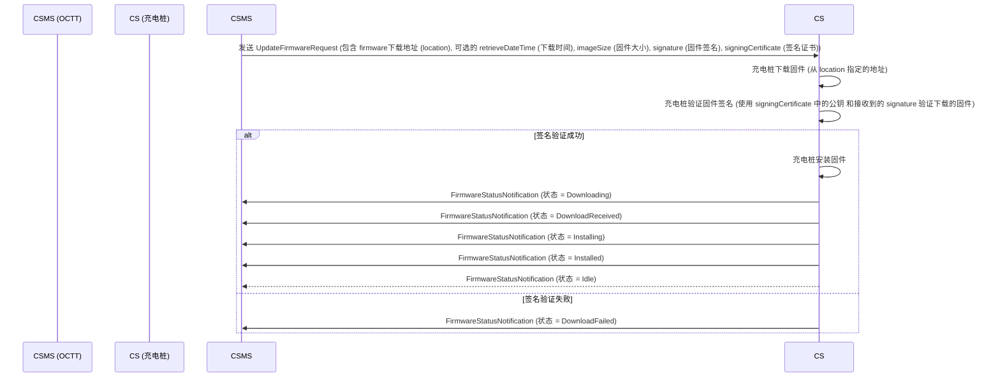
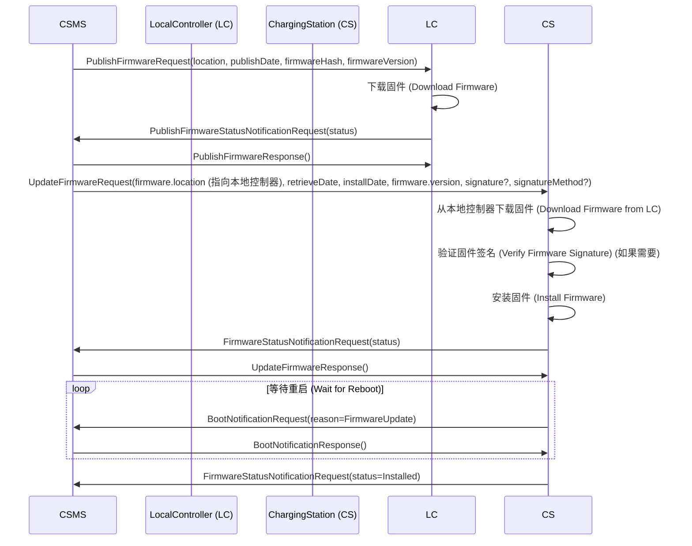
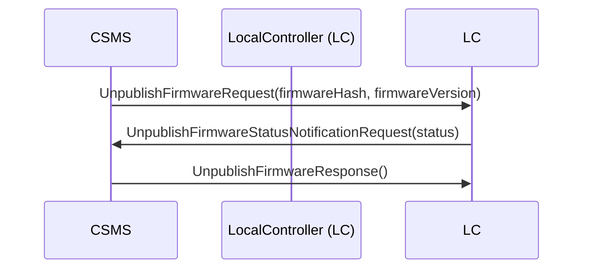

# L固件管理

## 介绍

这个功能块描述了CSO（充电站操作员）更新充电站固件的功能。

当需要更新充电站的新固件时，CSMS（充电站管理系统）通知充电站可以开始下载新固件的时间。充电站在每个步骤后都应通知CSMS，以表明它正在下载和安装新固件。

- **L01 - 安全固件更新 (Secure Firmware Update)**
- **L02 - 非安全固件更新 (Non-Secure Firmware Update)**
- **L03 - 在本地控制器上发布固件文件 (Publish Firmware file on Local Controller)**
- **L04 - 取消发布本地控制器上的固件文件 (Unpublish Firmware file on Local Controller)**

参考 Everest 的固件升级的实现。

## 用例

### 固件安全更新

#### 流程

说明充电站如何处理安全固件更新

1. CSMS发送一个`UpdateFirmwareRequest`消息，其中包含==固件的位置==、==应在哪个时间之后检索固件==，以及==充电站应重试下载固件的次数==的信息。
2. 充电站验证证书的有效性，==根据制造商的根证书==进行验证。
3. 如果证书有效，充电站开始下载固件，并发送一个带有状态`Downloading`的`FirmwareStatusNotificationRequest`。
   如果证书无效或无法验证，充电站中止固件更新过程，并发送一个带有状态`InvalidCertificate`的`UpdateFirmwareResponse`和一个带有安全事件`InvalidFirmwareSigningCertificate`的`SecurityEventNotificationRequest`（完整的安全事件列表请参见附录部分2）。
4. 如果固件成功下载，充电站发送一个带有状态`Downloaded`的`FirmwareStatusNotificationRequest`。
   否则，它发送一个带有状态`DownloadFailed`的`FirmwareStatusNotificationRequest`。
5. 如果验证成功，充电站发送一个带有状态`Installing`的`FirmwareStatusNotificationRequest`。
   如果固件验证失败或者签名完全缺失，充电站发送一个带有状态`InvalidSignature`的`FirmwareStatusNotificationRequest`，并发送一个带有安全事件`InvalidFirmwareSignature`的`SecurityEventNotificationRequest`（完整的安全事件列表请参见附录部分2）。
6. 如果安装成功，充电站发送一个带有状态`Installed`的`FirmwareStatusNotificationRequest`。
   否则，它发送一个带有状态`InstallationFailed`的`FirmwareStatusNotificationRequest`。

1. requestId = 123是一个示例请求的标识符，实际上可以使用任何值来标识请求。
2. 应采取措施来确保存储在服务器或工作站上的固件的安全性。
3. 充电站具有一个必需的配置变量，用于**报告它支持哪些文件传输协议**，即FileTransferProtocols。
4. 当迁移到OCPP的新版本时，建议安装一个具有新配置的备用NetworkConnectionProfile。
5. 有关Firmware Signing Certificate的要求在证书属性部分描述。
6. 制造商==不得==在充电站的固件签名证书中==使用====中间证书==。
7. FTP==需要能够使用被动FTP==（Passive FTP），以便能够在不同的拓扑结构下正常工作。

#### 要求

| ID        | Precondition                                                                                                                                                          | Requirement definition                                                                                                                                                                    | Note                                                                   |
| --------- | --------------------------------------------------------------------------------------------------------------------------------------------------------------------- | ----------------------------------------------------------------------------------------------------------------------------------------------------------------------------------------- | ---------------------------------------------------------------------- |
| L01.FR.01 | 当充电站在固件更新过程中进入新状态时。                                                                                                                                                   | 充电站应向CSMS发送`FirmwareStatusNotificationRequest`消息，并在消息中包含新的固件状态。关于使用哪个原因的详细描述可以在FirmwareStatusEnumType的描述中找到。                                                                              |                                                                        |
| L01.FR.02 | 当充电站在固件更新过程中进入"Invalid Certificate"状态时                                                                                                                                | 充电站在出现"Invalid Certificate"状态时，应发送一个`SecurityEventNotificationRequest`消息给CSMS，其中包含安全事件"InvalidFirmwareSigningCertificate"。 您可以在协议的附录部分（part 2 appendices）中找到完整的安全事件列表，以确保选择了正确的事件代码。 |                                                                        |
| L01.FR.03 | 当充电站在固件更新过程中进入"Invalid Signature"状态时                                                                                                                                  | 充电站应发送一个`SecurityEventNotificationRequest`消息给CSMS，其中包含安全事件"InvalidFirmwareSignature"。 您可以在协议的附录部分（part 2 appendices）中找到完整的安全事件列表，以确保选择了正确的事件代码。                                      |                                                                        |
| L01.FR.04 | 当充电站成功下载了新固件时                                                                                                                                                         | 对于验证签名，通常使用RSA-PSS或ECSchnorr签名算法以及SHA256哈希算法来计算整个固件文件上的签名。                                                                                                                                |                                                                        |
| L01.FR.05 | L01.FR.04 AND ( 固件安装日期和时间没有被设置 OR current time >= installDateTime )                                                                                           | 充电站应尽快安装新固件。                                                                                                                                                                              |                                                                        |
| L01.FR.06 | L01.FR.05 AND 充电站正在进行交易AND 在安装固件期间无法继续充电                                                                                                                  | 充电站应==等待所有交易结束后才开始安装==。                                                                                                                                                                   |                                                                        |
| L01.FR.07 | L01.FR.06 AND 配置变量`AllowNewSessionsPendingFirmw` areUpdate为假或不存在                                                                                                  | 在固件安装完成之前，任何可用的连接器都应设置为`UNAVAILABLE`。                                                                                                                                                     |                                                                        |
| L01.FR.08 |                                                                                                                                                                       | 建议将固件以加密方式发送到充电站。这可以通过以下两种方式来实现：使用安全协议（如HTTPS、SFTP或FTPS）发送固件，==或==在发送之前对固件进行加密。                                                                                                           |                                                                        |
| L01.FR.09 |                                                                                                                                                                       | 固件更新必须受到数字保护，以确保其真实性并提供源头证明。                                                                                                                                                              | 通过对固件图像的哈希值应用数字签名来实现此保护。理想情况下，这个签名已经由制造商计算出来。这样，固件图像的来源证明可以追溯到固件的原始作者。 |
| L01.FR.10 |                                                                                                                                                                       | 对于固件更新发送的每个`FirmwareStatusNotificationRequest`，都应包含与启动此固件更新的`UpdateFirmwareRequest`相同的requestId。                                                                                          |                                                                        |
| L01.FR.11 |                                                                                                                                                                       | 出于安全考虑，CSMS在`UpdateFirmwareRequest`中应包括固件签名证书（请参阅OCPP中使用的密钥）。                                                                                                                             |                                                                        |
| L01.FR.12 |                                                                                                                                                                       | 为了验证证书（请参阅证书层次结构），==使用X.509证书==的规则[19]。充电站必须使用固件签名证书来验证文件的数字签名。                                                                                                                           |                                                                        |
| L01.FR.13 | 当充电站由于正在充电或因为retrieveDateTime在未来时而不开始下载固件时。                                                                                                                           | 充电站应该发送一个状态为DownloadScheduled的`FirmwareStatusNotificationRequest`。                                                                                                                        |                                                                        |
| L01.FR.14 | 当充电站进入下载暂停状态时。                                                                                                                                                        | 充电站应该发送一个状态为DownloadPaused的`FirmwareStatusNotificationRequest`。                                                                                                                           | 例如，当充电站有更高优先级的任务时。                                                     |
| L01.FR.15 | 当充电站在安装已下载的固件之前需要重新启动时。                                                                                                                                               | 充电站在重新启动之前应发送一个状态为`InstallRebooting`的`FirmwareStatusNotificationRequest`。                                                                                                                 |                                                                        |
| L01.FR.16 | L01.FR.04 AND 当installDateTime被设置为将来的时间时。                                                                                                                         | 充电站应发送一个状态为InstallScheduled的`FirmwareStatusNotificationRequest`，并在指定的安装时间安装固件。                                                                                                            |                                                                        |
| L01.FR.20 |                                                                                                                                                                       | `FirmwareStatusNotificationRequest`中的requestId字段是强制的，除非status = Idle。                                                                                                                     |                                                                        |
| L01.FR.21 | 当充电站收到一个`UpdateFirmwareRequest`时。                                                                                                                                     | 充电站应在接受消息之前验证证书的有效性。                                                                                                                                                                      |                                                                        |
| L01.FR.22 | L01.FR.21 AND 证书是非法的                                                                                                                                              | 充电站应以状态为InvalidCertificate的`UpdateFirmwareResponse`进行响应。                                                                                                                                  |                                                                        |
| L01.FR.23 | 当充电站在固件更新过程中需要重新启动，并且引导加载程序无法发送OCPP消息时。                                                                                                                               | 在充电站需要在固件更新期间重新启动并且引导加载程序无法发送OCPP消息时，充电站可以省略状态为Installing的`FirmwareStatusNotificationRequest`消息。                                                                                          |                                                                        |
| L01.FR.24 | 当充电站正在安装新的固件，或者即将安装新的固件但已收到更新固件命令以在以后的某个时间安装它，并且充电站接收到新的`UpdateFirmwareRequest`时。                                                                                     | 充电站应该取消正在进行的固件更新，并回复状态AcceptedCanceled。                                                                                                                                                   | 充电站不应首先检查新的固件文件是否存在，这样CSMS将能够在不启动新固件更新的情况下取消正在进行的固件更新。                 |
| L01.FR.25 | 当充电站收到一个用于FirmwareStatusNotification的TriggerMessageRequest，同时上一次发送的FirmwareStatusNotificationRequest的状态为Installed时。                                                   | 充电站应返回一个状态为Idle的FirmwareStatusNotificationRequest。                                                                                                                                        |                                                                        |
| L01.FR.26 | 充电站收到`FirmwareStatusNotification`的_TriggerMessageRequest_，且上一次发送的`FirmwareStatusNotificationRequest`的状态不是Installed时，应该返回一个带有上次状态的`FirmwareStatusNotificationRequest`。 | 充电站应返回一个带有上次发送状态的FirmwareStatusNotificationRequest。                                                                                                                                       |                                                                        |
| L01.FR.27 | L01.FR.24 AND 充电站无法取消固件安装时。                                                                                                                                   | 充电站可以回应状态=已拒绝。                                                                                                                                                                            |                                                                        |
| L01.FR.28 | 当充电站成功安装了新的固件时。                                                                                                                                                       | 充电站应发送一个状态为已安装的`FirmwareStatusNotificationRequest`消息，并且充电站应该已经激活了新的固件，或者立即激活它。                                                                                                            | 激活新固件可能涉及自动重启，但不一定如此。                                                  |
| L01.FR.29 | 如果新固件的验证失败（例如，使用校验和或其他方式），则应采取适当的措施。                                                                                                                                  | 充电站应发送一个状态为"InstallVerificationFailed"的`FirmwareStatusNotificationRequest`消息。                                                                                                             |                                                                        |
| L01.FR.30 | 当充电站在下载固件时多次重试但失败时，充电站应发送一个状态为"DownloadFailed"的`FirmwareStatusNotificationRequest`消息。                                                                                 | 充电站应发送一个状态为"DownloadFailed"的`FirmwareStatusNotificationRequest`消息，表示在下载固件时多次重试但失败。                                                                                                        | 充电站可以在每次重试尝试时发送新的"Downloading"状态。                                      |
| L01.FR.31 | L01.FR.28                                                                                                                                                             | 充电站应发送一个type为"FirmwareUpdated"的`SecurityEventNotificationRequest`消息。                                                                                                                      |                                                                        |
| L01.FR.32 | 当充电站需要在激活已下载的固件之前重新启动时。                                                                                                                                               | 充电站在重新启动之前可以发送一个状态为"InstallRebooting"的`FirmwareStatusNotificationRequest`消息。                                                                                                              |                                                                        |

### 非安全的固件更新

#### 流程

1. CSMS发送一个包含固件位置、应该在何时检索以及充电站应该尝试多少次下载固件的`UpdateFirmwareRequest`消息。
2. 充电站回应`UpdateFirmwareResponse`。
3. 充电站发送一个包含状态`Downloading`的`FirmwareStatusNotificationRequest`。
4. CSMS回应`FirmwareStatusNotificationResponse`。
5. 充电站发送一个包含状态`Downloaded`的`FirmwareStatusNotificationRequest`。
6. CSMS回应`FirmwareStatusNotificationResponse`。
7. 充电站发送一个包含状态`Installing`的`FirmwareStatusNotificationRequest`。
8. CSMS回应`FirmwareStatusNotificationResponse`。
9. 充电站发送一个包含状态`Installed`的`FirmwareStatusNotificationRequest`。
10. CSMS回应`FirmwareStatusNotificationResponse`。

#### 要求

| ID        | Precondition                                                                                                                                                                         | Requirement definition                                                                                                                     | Note                                                                                                                            |
| --------- | ------------------------------------------------------------------------------------------------------------------------------------------------------------------------------------ | ------------------------------------------------------------------------------------------------------------------------------------------ | ------------------------------------------------------------------------------------------------------------------------------- |
| L02.FR.01 | 每当充电站在固件更新过程中进入新的状态时。                                                                                                                                                                | 充电站应向CSMS发送包含新状态的`FirmwareStatusNotificationRequest`消息。                                                                                    |                                                                                                                                 |
| L02.FR.02 | 当充电站成功下载了新的固件，并且（installDateTime未设置或当前时间大于等于installDateTime）时。                                                                                                                       | 充电站应尽快安装新的固件。                                                                                                                              |                                                                                                                                 |
| L02.FR.03 | L02.FR.02 AND 充电站正在进行交易。AND 在安装固件期间无法继续充电时。                                                                                                                              | 充电站应等待所有交易结束后才能开始安装。                                                                                                                       |                                                                                                                                 |
| L02.FR.04 | L02.FR.03 AND 如果配置变量"`AllowNewSessionsPendingFirmwareUpdate`"为false或不存在，那么在安装固件期间，充电站不应允许新的会话。                                                                                   | 在充电站等待正在进行的交易结束期间，充电站应将所有未使用的连接器设置为UNAVAILABLE。在安装固件之前，任何变为可用的连接器都应设置为UNAVAILABLE。                                                         |                                                                                                                                 |
| L02.FR.05 |                                                                                                                                                                                      | 建议以加密方式发送固件给充电站。可以通过使用安全协议（如HTTPS、SFTP或FTPS）发送固件，`或`在发送之前对固件进行加密来实现。                                                                       |                                                                                                                                 |
| L02.FR.06 |                                                                                                                                                                                      | 用于固件更新的每个`FirmwareStatusNotificationRequest`都应包含与启动此固件更新的`UpdateFirmwareRequest`相同的requestId。                                              |                                                                                                                                 |
| L02.FR.07 | 当充电站因正在充电忙碌或retrieveDateTime在将来时，不启动固件下载。                                                                                                                                            | 充电站应发送一个带有状态DownloadScheduled的FirmwareStatusNotificationRequest。                                                                           |                                                                                                                                 |
| L02.FR.08 | 当充电站进入下载暂停状态时。                                                                                                                                                                       | 充电站应该发送一个状态为DownloadPaused的`FirmwareStatusNotificationRequest`。                                                                            | 例如，当充电站有更高优先级的任务时。                                                                                                              |
| L02.FR.09 | 当充电站在安装已下载的固件之前需要重新启动时。                                                                                                                                                              | 充电站在重新启动之前应发送一个状态为`InstallRebooting`的`FirmwareStatusNotificationRequest`。                                                                  |                                                                                                                                 |
| L02.FR.10 | 已经下载完成 AND 当installDateTime被设置为将来的时间时。                                                                                                                                           | 充电站应发送一个状态为InstallScheduled的`FirmwareStatusNotificationRequest`，并在指定的安装时间安装固件。                                                             |                                                                                                                                 |
| L02.FR.14 |                                                                                                                                                                                      | 在`FirmwareStatusNotificationRequest`中，除非状态是Idle，否则requestId字段是必需的。                                                                         |                                                                                                                                 |
| L02.FR.15 | 当充电站正在安装新的固件或即将安装新的固件，但已收到一个安装它的UpdateFirmware命令，然后充电站又收到一个新的`UpdateFirmwareRequest`时，充电站应该取消正在进行的固件更新，并回应状态为AcceptedCanceled。                                                       | 充电站应取消正在进行的固件更新，并回应状态为AcceptedCanceled。                                                                                                    | 充电站不应首先检查新的固件文件是否存在，这样CSMS将能够取消正在进行的固件更新而不启动新的更新。                                                                               |
| L02.FR.16 | 充电站收到一个用于触发`FirmwareStatusNotification`消息的TriggerMessageRequest，并且上次发送的`FirmwareStatusNotificationRequest`的状态为Installed。 充电站应该返回一个`FirmwareStatusNotificationRequest`，其中状态为Idle。 | 充电站应返回一个状态为Idle的`FirmwareStatusNotificationRequest`。                                                                                       |                                                                                                                                 |
| L02.FR.17 | 充电站收到一个TriggerMessageRequest for `FirmwareStatusNotification`并且最后一次发送的`FirmwareStatusNotificationRequest`的状态为NOT Installed                                                           | 充电站应返回一个具有与上一次发送的`FirmwareStatusNotificationRequest`相同状态的`FirmwareStatusNotificationRequest`。                                              |                                                                                                                                 |
| L02.FR.18 | L02.FR.15 AND 如果充电站无法取消固件安装，那么它应该按照上一次的状态返回`FirmwareStatusNotificationRequest`。                                                                                              | 如果充电站无法取消固件安装，它可以选择以状态 "Rejected" 回应。                                                                                                      |                                                                                                                                 |
| L02.FR.19 | 当充电站下载固件的所有尝试都失败时。                                                                                                                                                                   | 充电站应发送状态为DownloadFailed的`FirmwareStatusNotificationRequest`                                                                                | 充电站可以在每次重试尝试时发送一个新的下载状态。                                                                                                        |
| L02.FR.20 | 当充电站成功安装并激活新固件时                                                                                                                                                                      | 充电站应发送状态为Installed的`FirmwareStatusNotificationRequest`。                                                                                    | 激活新固件可能需要重新启动。                                                                                                                  |
| L02.FR.21 | 当充电站成功安装新固件并且充电站==需要重新启动==才能激活新固件时                                                                                                                                                   | 充电站应发送`FirmwareStatusNotificationRequest`，状态设置为Installed或优选为InstallRebooting并报告另一个激活新固件后，状态为Installed的`FirmwareStatusNotificationRequest`。 | 报告状态为installreboot的`firmwarestatusnotificationrequest`是可选的，但是如果认为有必要向CSMS报告充电站成功安装了新固件，但在能够激活新固件之前需要重新启动，则建议使用状态为installreboot。 |

### 在本地控制器上发布固件文件

#### 流程

1. CSMS发送一个`PublishFirmwareRequest`请求，以指示本地控制器下载和发布固件，包括==固件文件==的==MD5校验和==。
2. 本地控制器在接收到`PublishFirmwareRequest`后，回应`PublishFirmwareResponse`。
3. 本地控制器开始下载固件。
4. 本地控制器验证MD5校验和。
5. 本地控制器将固件文件发布到`PublishFirmwareStatusNotificationRequest`中指定的URI（统一资源标识符）。
6. CSMS按照Use Case L01 - 安全固件更新中描述的方式指示充电站更新其固件。（上面的安全更新， 对于桩端而言）

#### 要求

| ID        | Precondition                                                                                                                                         | Requirement definition                                                                                                                                                                                          |
| --------- | ---------------------------------------------------------------------------------------------------------------------------------------------------- | --------------------------------------------------------------------------------------------------------------------------------------------------------------------------------------------------------------- |
| L03.FR.01 |                                                                                                                                                      | 当本地控制器在发布过程中进入一个新状态时，它应该向csms发送`PublishFirmwareStatusNotificationRequest`消息。                                                                                                                                    |
| L03.FR.02 |                                                                                                                                                      | MD5校验和将在整个固件文件中计算。                                                                                                                                                                                              |
| L03.FR.03 |                                                                                                                                                      | 本地控制器应使用其支持的所有协议(例如HTTP、HTTPS和FTP)发布固件文件。                                                                                                                                                                       |
| L03.FR.04 |                                                                                                                                                      | 本地控制器应在`PublishFirmwareStatusNotificationRequest`消息的location字段中设置所有支持的协议（例如HTTP、HTTPS和FTP）的URL，状态为==Published==。这意味着本地控制器应提供用于下载固件的==多个不同协议==的URL，以便充电站可以选择使用适合其环境和需求的协议来获取固件更新。这提供了更大的灵活性，以确保固件更新可在不同的网络环境中进行。 |
| L03.FR.05 | 在接收到`PublishFirmwareRequest`消息后                                                                                                                      | 本地控制器应该响应一个`publishfirmwarerresponse`消息，表明它是否已经接受了请求。                                                                                                                                                           |
| L03.FR.06 | 本地控制器无法下载固件文件。                                                                                                                                       | 本地控制器应发送一个`PublishFirmwareStatusNotificationRequest`，状态为`DownloadFailed`。                                                                                                                                       |
| L03.FR.07 | 如果本地控制器无法验证MD5校验和。                                                                                                                                   | 本地控制器应发送一个`PublishFirmwareStatusNotificationRequest`，状态为`InvalidChecksum`。                                                                                                                                      |
| L03.FR.08 | 本地控制器无法发布固件文件。                                                                                                                                       | 本地控制器应发送一个`PublishFirmwareStatusNotificationRequest`，状态为`PublishFailed`。                                                                                                                                        |
| L03.FR.09 | 固件文件发布成功后。                                                                                                                                           | 本地控制器应发送一个`PublishFirmwareStatusNotificationRequest`，状态为`Published`。                                                                                                                                            |
| L03.FR.10 | 充电站收到一个`TriggerMessageRequest`，该请求用于触发`PublishFirmwareStatusNotification`消息的发送。这个请求可能是由于上一次发送的`PublishFirmwareStatusNotificationRequest`状态为Published | 充电站应返回`PublishFirmwareStatusNotificationRequest` 状态为Idle。                                                                                                                                                       |
| L03.FR.11 | 充电站收到一个`TriggerMessageRequest`，该请求用于触发`PublishFirmwareStatusNotification`消息的发送，并且上一次发送的`PublishFirmwareStatusNotificationRequest`消息的状态不是Published。   | 在这种情况下，充电站应返回一个`PublishFirmwareStatusNotificationRequest`消息，其中包含上一次发送的固件状态。                                                                                                                                     |

### 在本地控制器上取消发布固件文件

#### 流程

1. CSMS发送一个`UnpublishFirmwareRequest`请求，以指示本地控制器解除发布固件。
2. 本地控制器执行解除发布固件的操作，将固件从可访问的状态移除。
3. 本地控制器向CSMS回复一个`UnpublishFirmwareResponse`消息，以确认成功解除发布固件。

#### 要求

| ID        | Precondition                                            | Requirement definition                                    |
| --------- | ------------------------------------------------------- | --------------------------------------------------------- |
| L04.FR.01 | 如果本地控制器接收到`UnpublishFirmwareRequest`消息==AND==没有正在进行的下载。 | 固件文件不应发布。                                                 |
| L04.FR.02 | 成功取消发布固件文件后。                                            | 本地控制器应该发送状态为`Unpublished`的`UnpublishFirmwarerResponse`消息。 |
| L04.FR.03 | 如果本地控制器接收到`UnpublishFirmwareRequest`消息==AND==没有已发布的文件。  | 本地控制器发送状态为`NoFirmware`的`UnpublishFirmwarerResponse`消息。    |
| L04.FR.04 | 如果本地控制器接收到`UnpublishFirmwareRequest`消息==AND==正在下载文件     | 本地控制器应==以下载状态响应==，而不是取消发布固件文件。                            |
