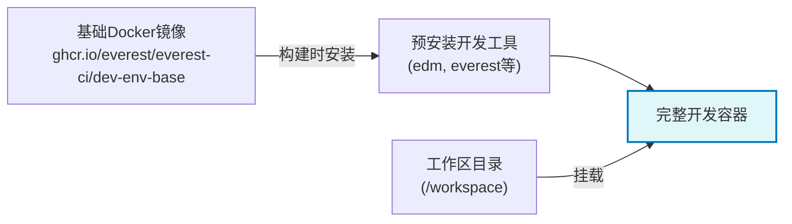
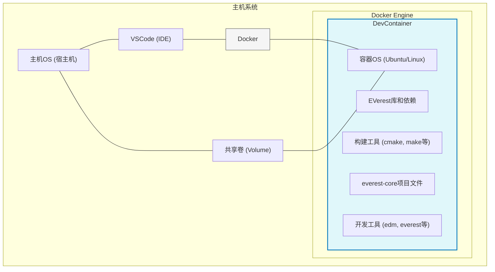
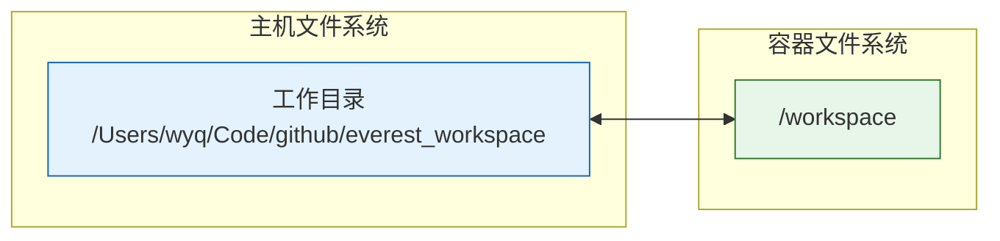
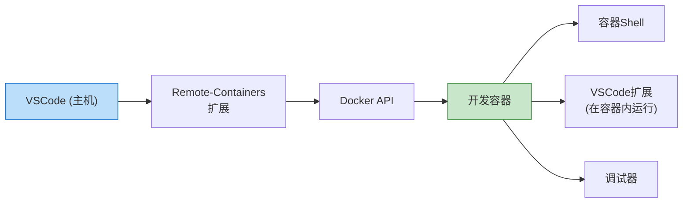

devcontainer 设置是开发 EVerest 项目的一种便捷方式。它使用 Docker 创建跨不同机器一致的开发环境。

cd /workspace/.devcontainer && docker compose up -d# 创建基于 devcontainer 的 EVerest 工作区

## 创建并进入工作区

```shell
mkdir everest_workspace
cd everest_workspace
```

## 运行安装脚本

```shell
export BRANCH="main" && bash -c "$(curl -s --variable %BRANCH=main --expand-url https://raw.githubusercontent.com/EVerest/everest-dev-environment/{{BRANCH}}/devcontainer/setup-devcontainer.sh)"
```

该脚本将要求您提供以下信息：

1. Workspace directory: 默认为当前目录，按回车键即可保持默认。
2. everest-dev-environment version: 默认为“main”。按 Enter 键保留默认设置。

mac下会出现 **realpath** 命令不支持 **-m** 选项的问题。执行`brew install coreutils`，然后将下面的行添加到你的 shell 配置文件，配置环境变量。

```shell
export PATH="/usr/local/opt/coreutils/libexec/gnubin:$PATH"
```

## 在 Visual Studio Code 中打开工作区

在 vscode 中打开这个文件夹，VS Code 将要求在容器中重新打开工作区。单击按钮“在容器中重新打开”。

等待安装各种依赖。

# everest-core

## 下载核心库everest-core

```shell
everest clone everest-core
```

或者

```shell
everest clone everest-core --https
```

## 编译并安装

```shell
mkdir -p everest-core/build
cd everest-core/build
cmake ..
make -j$(nproc) install
```

这里对比[[/content/Notes/OCPP/Everest/搭建环境/构建EVerest|构建EVerest]]的内容，不需要先构建 edm 的内容。在devcontainer环境中，很多初始步骤已经完成了，这与标准安装步骤不同。
在devcontainer中：

- EDM==已预安装== - edm命令已在/usr/local/bin/edm可用
- Everest工具已预安装 - everest命令也已在~/.local/bin/everest可用
- 环境已预配置 - devcontainer已经设置好了所需的环境变量和依赖项



# docker 的隔离性

DevContainer的隔离性及其与直接在环境中开发的区别，可以通过下图清晰地理解：



## DevContainer的隔离性机制

### Docker容器隔离

DevContainer利用Docker容器技术实现以下隔离：

- **进程隔离**: 容器内的进程与主机系统隔离运行
- **文件系统隔离**: 容器有自己独立的文件系统
- **网络隔离**: 容器有独立的网络命名空间
- **资源隔离**: 可限制CPU、内存等资源使用

### 共享卷机制



- 主机工作目录被"挂载"到容器的`/workspace`目录
- **对容器中文件的修改立即反映到主机文件系统**
- 这使您可以使用主机上的工具(如Git)来管理文件，同时在容器内构建/运行

### VSCode一体化



- VSCode的Remote-Containers扩展充当桥梁
- 编辑器UI在主机上运行，但所有命令在容器内执行
- 调试、终端、代码补全都在容器环境中运行

## 与直接在主机环境开发的区别

| 特性         | DevContainer     | 直接在主机环境         |
| ---------- | ---------------- | --------------- |
| **依赖管理**   | 所有依赖预安装在容器中，相互隔离 | 全局安装依赖，可能产生版本冲突 |
| **环境一致性**  | 所有开发者使用完全相同的环境   | 环境因开发者配置不同而异    |
| **环境污染**   | 容器删除后不留痕迹        | 安装的工具和库留在系统中    |
| **多项目兼容性** | 不同项目可使用不同版本的同一依赖 | 依赖版本冲突需要虚拟环境等解决 |
| **资源使用**   | 更高的存储和内存开销       | 较低的系统资源占用       |
| **安全隔离**   | 提高安全性，容器权限有限     | 工具运行在本地系统，权限较高  |

## EVerest特有的优势

对于EVerest项目，DevContainer提供了：

1. **预配置工具链**: 所有EVerest特有工具(如edm、everest)已预装
2. **编译环境优化**: 已配置好所有编译依赖和标准
3. **一致性测试**: 确保所有开发者的代码在相同环境中测试
4. **简化协作**: 新开发者可快速上手，无需复杂的环境设置

这种隔离方式使得EVerest项目开发既能保持环境一致性，又不会污染您的主机系统，同时还能享受VSCode提供的现代开发体验。

# 连接平台

## 修改平台 URL

例如，如果想连接到地址为ws://example.com:8080的OCPP平台，可以使用以下命令：

```shell
cd /workspace/everest-core/build/dist/share/everest/modules/OCPP201/component_config/standardized
cp InternalCtrlr.json InternalCtrlr.json.bak  # 备份原文件
sed -i 's|"ocppCsmsUrl": "ws://localhost:9000"|"ocppCsmsUrl": "ws://example.com:8080"|g' InternalCtrlr.json
```

## 启动 Everest

```shell
./everest-core/build/run-scripts/run-sil-ocpp201.sh
```

### 解决 mqtt连接问题

```shell
cd /workspace/.devcontainer && docker compose up -d
```

### 修复连接问题


不知道哪来的野生时间格式，一直打印。

```c
ocpp::DateTime to_ocpp_datetime_or_now(const std::string& datetime_string) {
    std::optional<ocpp::DateTime> timestamp;
    try {
#ifndef UL_FIX_PATCH 
        // Fix malformed datetime string format if needed
        std::string fixed_datetime = datetime_string;
        
        // Check for format like "2025-03-20:02:26:05GMT" and fix it
        std::regex malformed_pattern("(\\d{4}-\\d{2}-\\d{2}):(\\d{2}:\\d{2}:\\d{2})(GMT|UTC)?");
        if (std::regex_match(datetime_string, malformed_pattern)) {
            // Replace ":" between date and time with "T" and ensure proper timezone format
            fixed_datetime = std::regex_replace(datetime_string, malformed_pattern, "$1T$2Z");
            EVLOG_info << "Fixed malformed datetime format from: " << datetime_string << " to: " << fixed_datetime;
        }
        
        return ocpp::DateTime(fixed_datetime);
#else
        return ocpp::DateTime(datetime_string);
#endif
    } catch (const ocpp::TimePointParseException& e) {
        EVLOG_warning << "Could not parse datetime string: " << e.what() << ". Using current DateTime instead";
    }
    return ocpp::DateTime();
}
```
