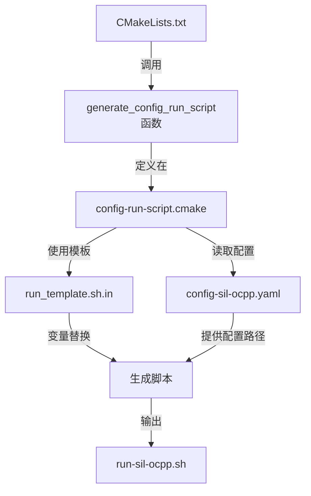

以run-sil-ocpp.sh为例



# 在CMakeLists.txt中调用生成函数

在checkout/everest-workspace/everest-core/config/CMakeLists.txt文件中，项目明确调用了生成脚本的函数：

```cmake
generate_config_run_script(CONFIG sil)
generate_config_run_script(CONFIG sil-two-evse)
generate_config_run_script(CONFIG sil-ocpp)  # 这一行负责生成run-sil-ocpp.sh
generate_config_run_script(CONFIG sil-ocpp201)
...
```

# 生成函数的定义

该函数在checkout/everest-workspace/everest-core/cmake/config-run-script.cmake中定义：

```cmake
function(generate_config_run_script)
    # 检查是否启用脚本生成
    if (NOT EVEREST_ENABLE_RUN_SCRIPT_GENERATION)
        return ()
    endif ()

    # 定义参数
    set(options "")
    set(one_value_args
        CONFIG
        LOGGING_CONFIG
        OUTPUT
    )
    set(multi_value_args
        ADDITIONAL_ARGUMENTS
    )

    # 解析参数
    cmake_parse_arguments(OPTNS "${options}" "${one_value_args}" "${multi_value_args}" ${ARGN})

    # 检查必要参数
    if (NOT OPTNS_CONFIG)
        message(FATAL_ERROR "${CMAKE_CURRENT_FUNCTION} requires CONFIG parameter for the config name")
    endif()

    # 设置配置文件路径
    set(CONFIG_FILE "${CMAKE_CURRENT_SOURCE_DIR}/config-${OPTNS_CONFIG}.yaml")
    if (NOT EXISTS ${CONFIG_FILE})
        message(FATAL_ERROR "${CMAKE_CURRENT_FUNCTION}: config file '${CONFIG_FILE}' does not exist")
    endif()

    # 设置日志配置文件路径
    set(LOGGING_CONFIG_FILE "${EVEREST_CONFIG_ASSET_DIR}/logging.ini")
    if (OPTNS_LOGGING_CONFIG)
        set(LOGGING_CONFIG_FILE "${CMAKE_CURRENT_SOURCE_DIR}/${OPTNS_LOGGING_CONFIG}.ini")
    endif()

    # 设置输出路径和文件名
    set(SCRIPT_OUTPUT_PATH "${CMAKE_BINARY_DIR}/run-scripts")
    set(SCRIPT_OUTPUT_FILE "${SCRIPT_OUTPUT_PATH}/run-${OPTNS_CONFIG}.sh")
    if (OPTNS_OUTPUT)
        set(SCRIPT_OUTPUT_FILE "${SCRIPT_OUTPUT_PATH}/run-${OPTNS_OUTPUT}.sh")
    endif()

    # 设置其他必要变量
    set(LD_LIBRARY_VAR "${CMAKE_INSTALL_PREFIX}/${CMAKE_INSTALL_LIBDIR}")
    set(PATH_VAR "${CMAKE_INSTALL_PREFIX}/${CMAKE_INSTALL_BINDIR}")

    # 使用模板生成脚本
    configure_file("${EVEREST_CONFIG_ASSET_DIR}/run_template.sh.in" ${SCRIPT_OUTPUT_FILE})
endfunction()
```

# 脚本模板内容

模板文件checkout/everest-workspace/everest-core/cmake/assets/run_template.sh.in的内容如下：

```sh
LD_LIBRARY_PATH=@LD_LIBRARY_VAR@:$LD_LIBRARY_PATH \
PATH=@PATH_VAR@:$PATH \
manager \
    --prefix @CMAKE_INSTALL_PREFIX@ \
    --conf @CONFIG_FILE@ \
    @ADDITIONAL_ARGUMENTS@
    $@
```

# 变量替换过程

在CMake构建过程中，configure_file 命令会将模板中的变量替换为实际值：

- `@LD_LIBRARY_VAR@` → `${CMAKE_INSTALL_PREFIX}/${CMAKE_INSTALL_LIBDIR}`
- `@PATH_VAR@` → `${CMAKE_INSTALL_PREFIX}/${CMAKE_INSTALL_BINDIR}`
- `@CMAKE_INSTALL_PREFIX@` → 安装前缀路径
- `@CONFIG_FILE@` → 配置文件路径，即`${CMAKE_CURRENT_SOURCE_DIR}/config-sil-ocpp.yaml`
- `@ADDITIONAL_ARGUMENTS@` → 其他附加参数

# 生成的脚本

最终，生成的run-sil-ocpp.sh脚本看起来类似这样：

```c
LD_LIBRARY_PATH=/安装路径/lib:$LD_LIBRARY_PATH \
PATH=/安装路径/bin:$PATH \
manager \
    --prefix /安装路径 \
    --conf /源代码路径/config-sil-ocpp.yaml \
<br/>
    $@
```

当用户运行脚本时，它执行manager程序并传递配置文件路径：

# 配置文件示例

config-sil-ocpp.yaml文件包含了运行时所需的配置信息，例如：

```yaml
active_modules:
  iso15118_charger:
    module: EvseV2G
    config_module:
      device: auto
      tls_security: allow
    connections:
      security:
        - module_id: evse_security
          implementation_id: main
  iso15118_car:
    module: PyEvJosev
    config_module:
      device: auto
      supported_ISO15118_2: true
  # 更多配置...
```

# 总结

1. CMake构建系统在处理CMakeLists.txt文件时，发现调用了generate_config_run_script(CONFIG sil-ocpp)
2. 执行该函数，找到对应的配置文件config-sil-ocpp.yaml
3. 使用run_template.sh.in模板，将其中的变量替换为实际值
4. 生成最终的run-sil-ocpp.sh脚本到构建目录
5. 这个脚本在运行时会启动带有指定配置的应用程序，主要用于OCPP（开放充电点协议）功能的测试和模拟。
