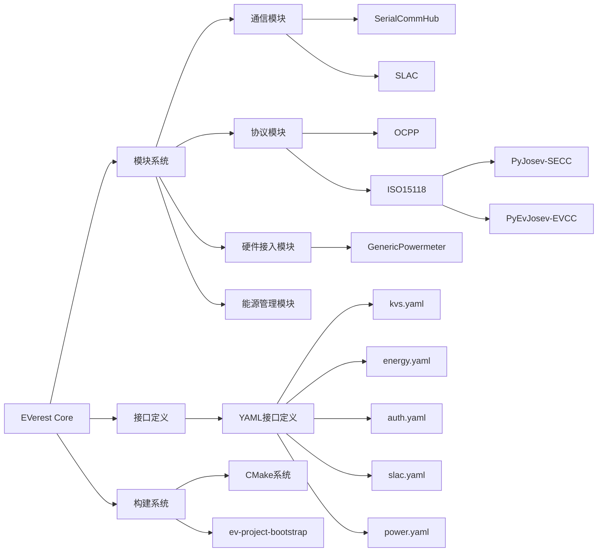
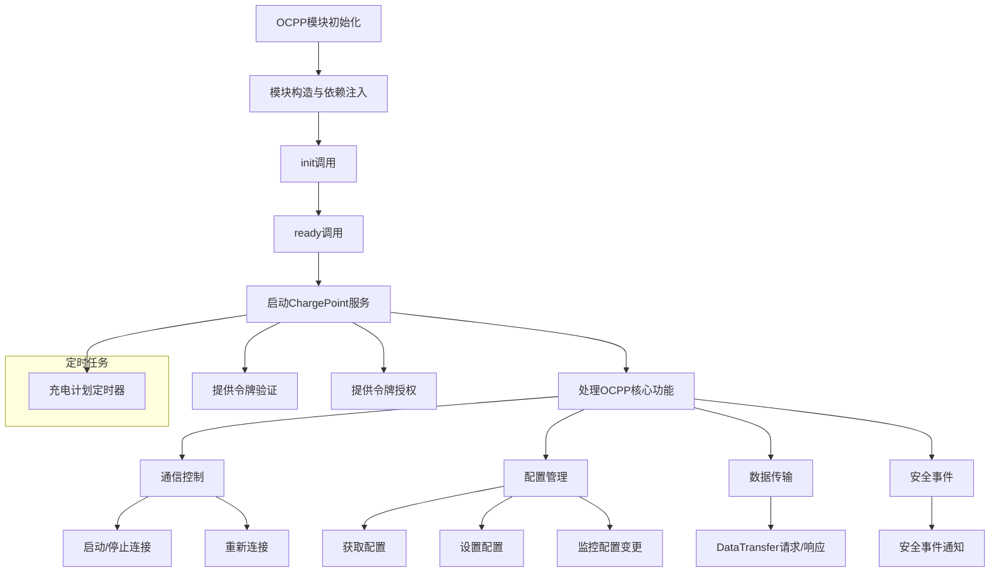

# 项目依赖

阅读CMakeLists.txt文件可以知道，项目EVerest依赖于多个组件：

1. everest-cmake - 项目的构建系统工具
2. Boost库 - 使用了filesystem、program_options、system和thread组件
3. [[./EVerest-framework|EVerest-framework]] - 核心框架
4. everest-sunspec - 太阳能相关组件
5. everest-modbus - Modbus通信协议支持
6. everest-ocpp - 开放充电点协议(Open Charge Point Protocol)支持
7. everest-openv2g - 电动汽车到电网(V2G)通信支持
8. PalSigslot - 信号槽库
9. fsm - 有限状态机
10. slac - 可能是Signal Level Attenuation Characterization的缩写，用于电力线通信
11. pugixml - XML解析库

这些项目通过EDM管理，当EDM不使能时，cmake会去查找本地安装的路径。

# 架构图



# 核心组件解析

## 模块系统

EVerest采用模块化设计，每个模块专注于特定功能

### GenericPowermeter

```sh
# 通过ModbusRTU协议连接和读取电表数据
# 支持AC和DC电表，通过配置文件描述寄存器映射
# 读取数据包括：能量、功率、电压、电流、频率等
```

### SerialCommHub

```c
// 串行通信中心，处理Modbus通信
response = modbus.txrx(target_device_id, tiny_modbus::FunctionCode::READ_MULTIPLE_HOLDING_REGISTERS,
                       first_register_address, num_registers_to_read);
```

### OCPP模块

```c
// 实现开放充电点协议
bool ocpp_1_6_charge_pointImpl::handle_restart() {
    std::lock_guard<std::mutex>(this->m);
    mod->charging_schedules_timer->interval(std::chrono::seconds(this->mod->config.PublishChargingScheduleIntervalS));
    bool success = mod->charge_point->restart();
    if (success) {
        this->mod->ocpp_stopped = false;
    }
    return success;
}
```

### ISO15118实现

#### PyJosev - 充电站侧实现(SECC)

```c
async def secc_handler_main_loop(module_config: dict):
    # 启动ISO 15118 SECC控制器
    config = Config()
    patch_josev_config(config, module_config)
    sim_evse_controller = await SimEVSEController.create()
    await SECCHandler(
        exi_codec=ExificientEXICodec(), evse_controller=sim_evse_controller, config=config
    ).start(config.iface)
```

#### PyEvJosev - 车辆侧实现(EVCC)

```c
async def evcc_handler_main_loop(module_config: dict):
    # 启动ISO 15118 EVCC控制器
    iface = determine_network_interface(module_config['device'])
    evcc_config = EVCCConfig()
    patch_josev_config(evcc_config, module_config)
    await EVCCHandler(
        evcc_config=evcc_config,
        iface=iface,
        exi_codec=ExificientEXICodec(),
        ev_controller=SimEVController(evcc_config),
    ).start()
```

## 接口定义系统

EVerest使用YAML文件定义模块间接口，采用统一的格式定义命令和变量

```yaml
# 接口示例 (kvs.yaml - 键值存储接口)
description: This interface defines a simple key-value-store interface
cmds:
  store:
    description: This command stores a value under a given key
    arguments:
      key:
        description: Key to store the value for
        type: string
        pattern: ^[A-Za-z0-9_.]*$
```

# OCPP模块

以OCPP模块为例，学习EVerest-core的构建到执行的过程。

## 架构流程图



## 核心组件解析

### 模块结构与初始化

#### 依赖注入机制

OCPP模块的初始化过程包括 构造函数中的依赖注入和init/ready方法：

```cpp
// OCPP.hpp - 模块构造函数
OCPP(const ModuleInfo& info, Everest::MqttProvider& mqtt_provider,
     std::unique_ptr<ocpp_1_6_charge_pointImplBase> p_main,
     std::unique_ptr<auth_token_validatorImplBase> p_auth_validator,
     std::unique_ptr<auth_token_providerImplBase> p_auth_provider,
     std::vector<std::unique_ptr<evse_managerIntf>> r_evse_manager,
     std::vector<std::unique_ptr<external_energy_limitsIntf>> r_connector_zero_sink,
     std::unique_ptr<reservationIntf> r_reservation, std::unique_ptr<authIntf> r_auth,
     std::unique_ptr<systemIntf> r_system, std::unique_ptr<evse_securityIntf> r_security, 
     Conf& config) :
    ModuleBase(info),
    mqtt(mqtt_provider),
    p_main(std::move(p_main)),
    p_auth_validator(std::move(p_auth_validator)),
    p_auth_provider(std::move(p_auth_provider)),
    r_evse_manager(std::move(r_evse_manager)),
    r_connector_zero_sink(std::move(r_connector_zero_sink)),
    r_reservation(std::move(r_reservation)),
    r_auth(std::move(r_auth)),
    r_system(std::move(r_system)),
    r_security(std::move(r_security)),
    config(config){};
```

这个构造函数显示该模块的复杂性，它需要多个接口交互，包括:

- 提供的接口: OCPP充电点、认证令牌验证、认证令牌提供
- 依赖的接口: EVSE管理器、能源限制、预约、认证、系统和安全

这种注入方式遵循依赖倒置原则，通过接口而非具体实现进行交互，提高了系统的解耦性和可测试性。

#### 初始化流程

OCPP模块的初始化分为两个阶段

##### 初始化阶段 (init)

- 创建ChargePoint实例
- 配置数据库路径
- 设置安全参数
- 建立MQTT连接
- 初始化定时器

##### 就绪阶段 (ready)

- 启动WebSocket连接
- 设置充电计划定时器
- 注册回调函数
- 订阅相关主题

##### 初始化代码示例

```cpp
void OCPP::init() {
    // 配置文件路径处理
    ocpp_share_path = std::filesystem::path(this->info.paths.share);
    
    // 创建ChargePoint核心对象
    charge_point = std::make_unique<ocpp::v16::ChargePoint>(
        /* 配置参数 */
    );
}

void OCPP::ready() {
	// 设置充电计划定时器
    charging_schedules_timer = std::make_unique<Everest::SteadyTimer>(
        [this](){
            // 定时发布充电计划
            this->publish_charging_schedules(
                this->charge_point->get_composite_schedule(
                    std::chrono::seconds(this->config.PublishChargingScheduleDurationS)
                )
            );
        }
    );
}
```

### ChargePoint核心组件

ChargePoint是OCPP模块的核心组件，负责所有OCPP通信：

- WebSocket管理：建立和维护与CSMS的WebSocket连接
- 消息序列化：将OCPP消息转换为JSON格式
- 会话管理：处理认证和会话状态
- 事务处理：管理充电事务的开始、进行和结束
- 配置管理：处理配置请求和更新

### 接口实现

#### ocpp_1_6_charge_pointImpl

`ocpp_1_6_charge_pointImpl`类实现了OCPP 1.6协议的主要功能:

```cpp
bool ocpp_1_6_charge_pointImpl::handle_stop() {
    std::lock_guard<std::mutex>(this->m);
    mod->charging_schedules_timer->stop();
    bool success = mod->charge_point->stop();
    if (success) {
        this->mod->ocpp_stopped = true;
    }
    return success;
}

bool ocpp_1_6_charge_pointImpl::handle_restart() {
    std::lock_guard<std::mutex>(this->m);
    mod->charging_schedules_timer->interval(std::chrono::seconds(this->mod->config.PublishChargingScheduleIntervalS));
    bool success = mod->charge_point->restart();
    if (success) {
        this->mod->ocpp_stopped = false;
    }
    return success;
}
```

数据转换函数示例：

```cpp
types::ocpp::KeyValue to_everest(const ocpp::v16::KeyValue& key_value) {
    types::ocpp::KeyValue _key_value;
    _key_value.key = key_value.key.get();
    _key_value.read_only = key_value.readonly;
    if (key_value.value.has_value()) {
        _key_value.value = key_value.value.value().get();
    }
    return _key_value;
}
```

#### auth_token_validatorImpl

实现令牌验证功能，将验证请求传递给OCPP后端：

```c
auth_token_validatorImpl::handle_validate_token(types::authorization::ProvidedIdToken& provided_token) {
    if (provided_token.authorization_type == types::authorization::AuthorizationType::PlugAndCharge) {
        return validate_pnc_request(provided_token);
    } else {
        return validate_standard_request(provided_token);
    }
};
```

#### auth_token_providerImpl

提供令牌信息给其他模块：

```cpp
// 伪代码
void auth_token_providerImpl::handle_get_token_info(const std::string& id_token, types::authorization::TokenInfo& token_info) {
    auto response = mod->charge_point->get_token_info(id_token);
    token_info.auth_status = convert_auth_status(response.status);
    // 填充其他令牌信息
}
```

这里为什么没有具体的实现代码？

### 配置管理功能

模块支持全面的配置管理，包括获取、设置和监控配置:

```cpp
// 获取配置
types::ocpp::GetConfigurationResponse ocpp_1_6_charge_pointImpl::handle_get_configuration_key(Array& keys) {
    ocpp::v16::GetConfigurationRequest request;
    std::vector<ocpp::CiString<50>> _keys;
    for (const auto& key : keys) {
        _keys.push_back(key);
    }
    request.key = _keys;

    const auto response = this->mod->charge_point->get_configuration_key(request);
    return to_everest(response);
}

// 监控配置变更
void ocpp_1_6_charge_pointImpl::handle_monitor_configuration_keys(Array& keys) {
    for (const auto& key : keys) {
        this->mod->charge_point->register_configuration_key_changed_callback(
            key,
            [this](const ocpp::v16::KeyValue key_value) { 
                this->publish_configuration_key(to_everest(key_value)); 
            });
    }
}
```

### 安全机制

OCPP模块通过EvseSecurity类实现OCPP安全功能：

```cpp
class evse_securityImpl : public evse_securityImplBase {
public:
    evse_securityImpl() = delete;
    evse_securityImpl(Everest::ModuleAdapter* ev, const Everest::PtrContainer<EvseSecurity>& mod, Conf& config) :
        evse_securityImplBase(ev, "main"), mod(mod), config(config){};
protected:
//伪代码
    EvseSecurity(evse_securityIntf& r_security);
    
    // 证书安装
    ocpp::InstallCertificateResult install_ca_certificate(const std::string& certificate,
                                                         const ocpp::CaCertificateType& certificate_type) override;
    
    // 证书删除
    ocpp::DeleteCertificateResult 
    delete_certificate(const ocpp::CertificateHashDataType& certificate_hash_data) override;
    
    // 证书验证
    ocpp::InstallCertificateResult verify_certificate(const std::string& certificate_chain,
                                                     const ocpp::CertificateSigningUseEnum& certificate_type) override;
    
    // 更多安全操作...
};
```

### 定时任务

模块使用定时器定期执行任务：

```cpp
// 初始化定时器
charging_schedules_timer = std::make_unique<Everest::SteadyTimer>();

// 设置定时任务
charging_schedules_timer->interval(std::chrono::seconds(config.PublishChargingScheduleIntervalS));
charging_schedules_timer->start();
```

## 模块执行流程

### 启动流程

1. 模块构造 - 依赖注入
2. init() - 初始化内部状态
3. ready() - 启动服务
4. 建立WebSocket连接
5. 注册回调函数
6. 开始定时任务

### OCPP消息处理流程

#### 接收消息

WebSocket接收CSMS消息
JSON解析为OCPP对象

#### 消息分发

根据消息类型调用对应处理函数
执行业务逻辑

#### 响应生成

创建响应对象
序列化为JSON
通过WebSocket发送

#### 状态更新

更新内部状态
发布相关事件

### 认证流程

1. 接收认证令牌
2. 发送Authorize.req消息到CSMS
3. 接收Authorize.conf响应
4. 转换OCPP认证状态为EVerest认证状态
5. 返回认证结果

### 充电计划处理

1. 定时器触发
2. 请求最新充电计划
3. 转换为EVerest格式
4. 发布到MQTT
5. 传递给能源限制接口

## 与其他模块交互

### EVSE管理器交互

```cpp
// 伪代码
void handle_evse_status_change(int32_t evse_id, evse_manager::EVSEState state) {
    // 转换状态
    ocpp::v16::ChargePointStatus cp_status = convert_evse_state(state);
    
    // 向CSMS发送状态变更
    charge_point->status_notification(evse_id, cp_status);
}
```

### 安全模块交互

```cpp
// 初始化安全组件
auto evse_security = std::make_shared<EvseSecurity>(*r_security);

// 配置ChargePoint使用安全组件
charge_point_config.evse_security = evse_security;
```

### OCPPExtensionExample扩展

通过OCPPExtensionExample模式，可以扩展OCPP功能:

```cpp
class OCPPExtensionExample : public Everest::ModuleBase {
public:
    OCPPExtensionExample(const ModuleInfo& info, 
                        std::unique_ptr<emptyImplBase> p_empty,
                        std::unique_ptr<ocpp_1_6_charge_pointIntf> r_ocpp, 
                        Conf& config);
                        
    void ready() {
        // 监控配置变更
        std::vector<std::string> keys_to_monitor = parse_keys(config.keys_to_monitor);
        r_ocpp->monitor_configuration_keys(keys_to_monitor);
        
        // 订阅变更通知
        r_ocpp->subscribe_configuration_key([this](types::ocpp::KeyValue key_value) {
            // 处理配置变更
        });
    }
};
```

# OCPP 2.0.1

todo
