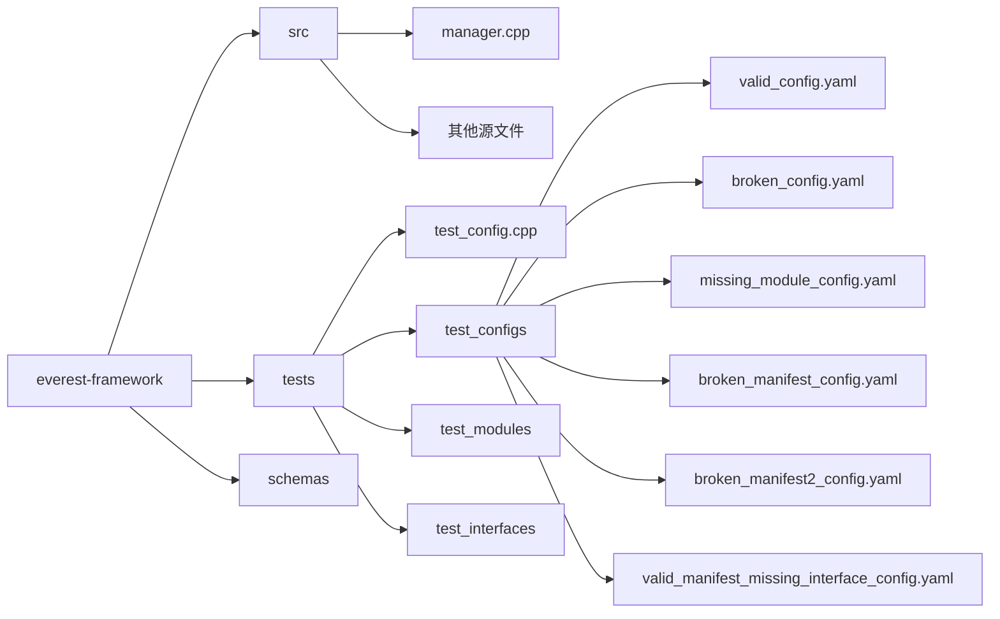
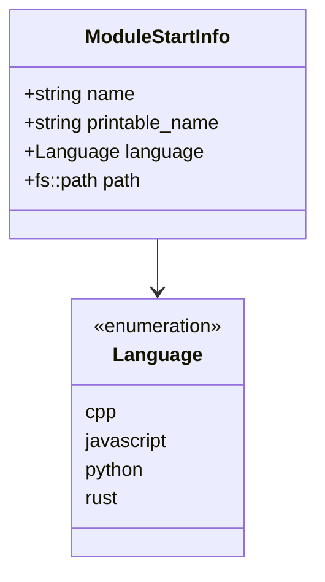
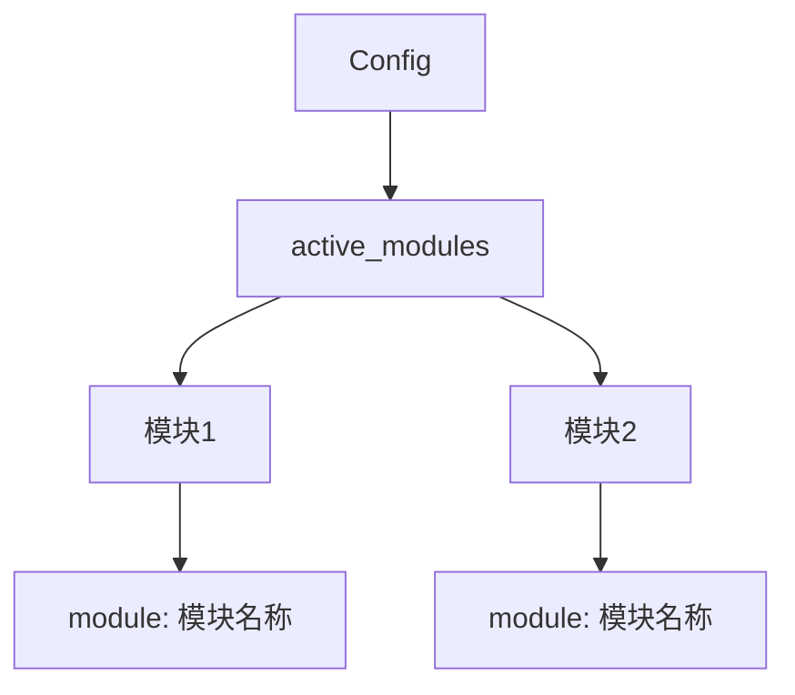
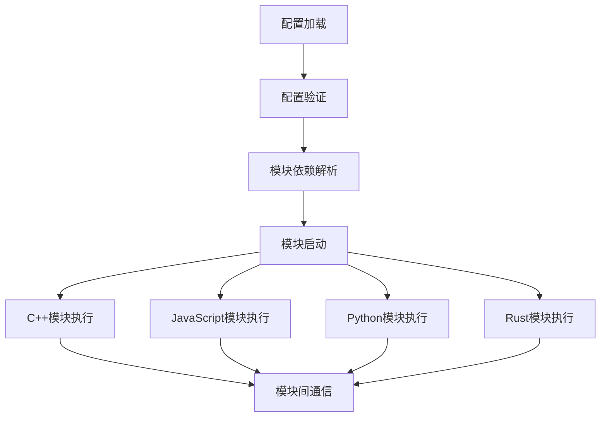
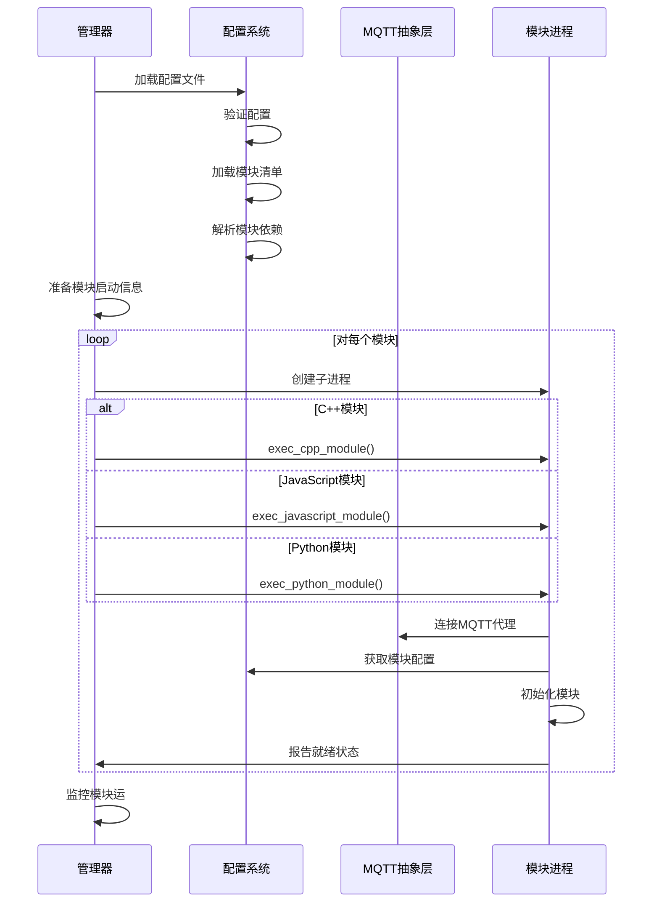
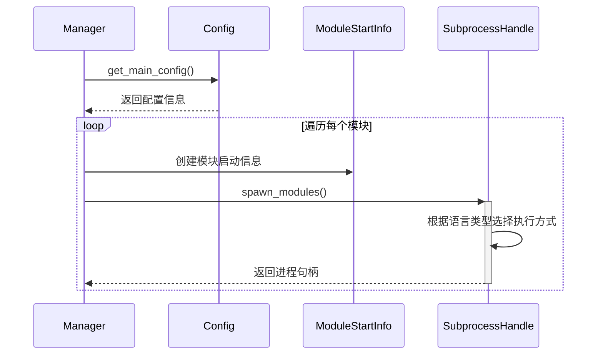
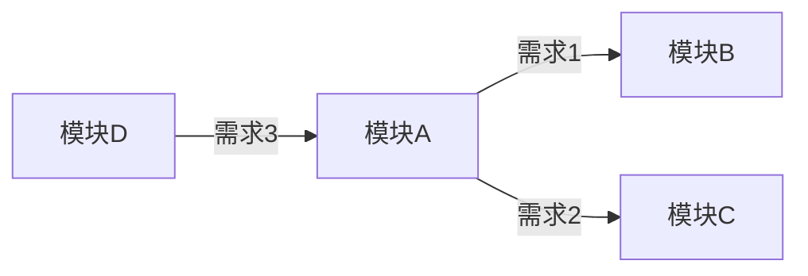
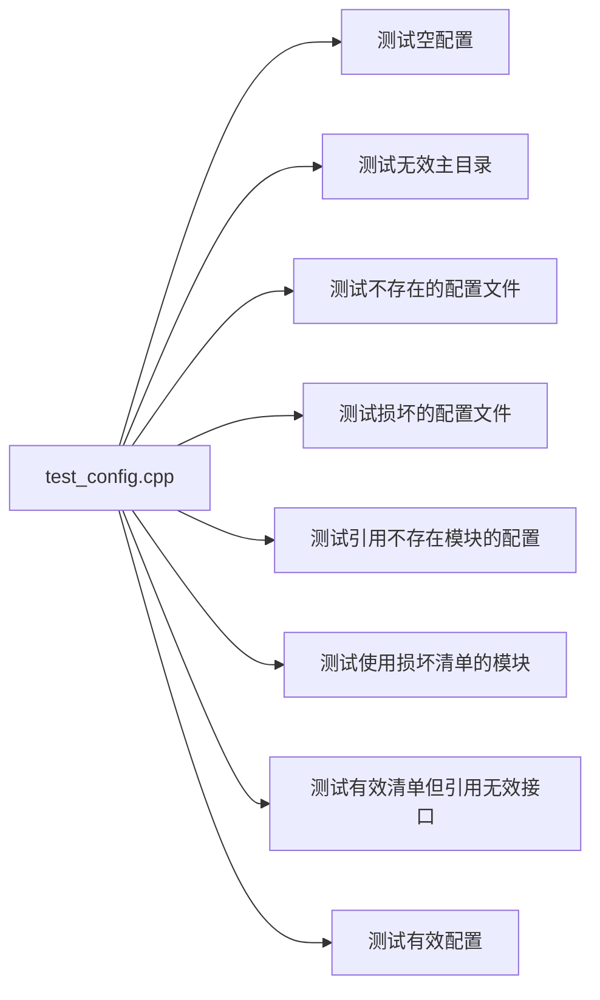

# 项目概述

EVerest-Framework 是一个支持多语言模块化开发的框架，主要用于电动汽车充电基础设施的开发。从代码中可以看出，它支持 C++、JavaScript、Rust 和 Python 编程语言的模块。

# 项目结构

```sh
EVerest-Framework/
│
├── cmake/                  # CMake 模块和辅助函数
│   ├── NodeApiVersion.cmake
│   └── find-mqttc.cmake
│
├── everestjs/              # JavaScript 模块支持
│   ├── CMakeLists.txt
│   ├── conversions.cpp
│   └── ...
│
├── everestpy/              # Python 模块支持
│   ├── CMakeLists.txt
│   ├── setup.cfg
│   └── src/
│       └── everest/
│
├── everestrs/              # Rust 模块支持（可选）
│   └── everestrs_sys/
│
├── include/                # 头文件
│   ├── compile_time_settings.hpp.in
│   └── ...
│
├── lib/                    # 核心库实现
│   ├── config.cpp          # 配置系统实现
│   └── ...
│
├── schemas/                # JSON Schema 定义
│   ├── config.yaml
│   ├── manifest.yaml
│   ├── interface.yaml
│   └── ...
│
├── src/                    # 源代码
│   ├── manager.cpp         # 主管理器实现
│   ├── controller/
│   └── ...
│
└── tests/                  # 测试代码
    ├── CMakeLists.txt
    ├── test_config.cpp
    ├── test_configs/
    ├── test_modules/
    └── test_interfaces/
```



# 核心组件

## 模块系统

从代码中可以看出，EVerest 框架支持多种语言的模块



## 配置系统

EVerest-Framework 的配置系统主要由 Config 类实现，负责加载、验证和处理配置文件，以及管理模块之间的依赖关系。配置系统使用 YAML 格式的配置文件来描述系统中的模块、它们的配置参数以及模块之间的连接关系。



### 配置系统工作流程

#### 配置文件加载

配置系统首先从指定路径加载主配置文件（通常是 config.yaml ）：

```cpp
// 在 Config 构造函数中加载配置文件
fs::path config_path = rs->config_file;
try {
    if (manager) {
        EVLOG_info << fmt::format("Loading config file at: {}", fs::canonical(config_path).string());
    }
    auto complete_config = load_yaml(config_path);
    
    // 尝试加载用户配置（如果存在）
    auto user_config_path = config_path.parent_path() / "user-config" / config_path.filename();
    if (fs::exists(user_config_path)) {
        // 加载用户配置并合并到主配置
        auto user_config = load_yaml(user_config_path);
        complete_config.merge_patch(user_config);
    }
    
    // 其他处理...
}
```

#### 配置验证

加载配置后，系统会使用 JSON Schema 验证配置的有效性：

```cpp
json_validator validator(Config::loader, Config::format_checker);
validator.set_root_schema(this->_schemas.config);
auto patch = validator.validate(complete_config);
if (!patch.is_null()) {
    // 使用默认值扩展配置
    complete_config = complete_config.patch(patch);
}
```

#### 类型和接口加载

配置系统还会加载类型定义和接口定义文件

```cpp
// 加载类型文件
for (auto const& types_entry : fs::recursive_directory_iterator(this->rs->types_dir)) {
    // 处理每个类型文件...
}

// 加载接口文件（在其他地方实现）
```

#### 模块依赖解析

一个关键功能是解析模块之间的依赖关系，通过 resolve_all_requirements 方法实现：

```cpp
void Config::resolve_all_requirements() {
    // 遍历所有模块
    for (auto& element : this->main.items()) {
        const auto& module_id = element.key();
        auto& module_config = element.value();
        
        // 检查模块的需求是否在清单中定义
        // ...
        
        // 解析每个需求
        for (auto& element : this->manifests[module_config["module"].get<std::string>()]["requires"].items()) {
            const auto& requirement_id = element.key();
            auto& requirement = element.value();
            
            // 检查需求是否满足
            // ...
            
            // 检查连接数量是否符合要求
            // ...
            
            // 验证每个连接
            for (uint64_t connection_num = 0; connection_num < connections.size(); connection_num++) {
                // 验证连接的模块是否存在
                // 验证接口是否匹配
                // ...
            }
        }
    }
}
```

#### 配置访问

配置系统提供了多种方法来访问配置数据：

```cpp
// 获取模块配置
ModuleConfigs Config::get_module_configs(const std::string& module_id) {
    // ...
}

// 解析模块需求
json Config::resolve_requirement(const std::string& module_id, const std::string& requirement_id) {
    // ...
}

// 获取接口定义
json Config::get_interface_definition(const std::string& interface_name) {
    // ...
}
```

### 配置文件结构

EVerest 的主配置文件结构如下：

```yaml
active_modules:
  module_id_1:
    module: "ModuleName1"
    config_maps:
      !module: { /* 模块级配置 */ }
      implementation_id_1: { /* 实现级配置 */ }
    connections:
      requirement_id_1:
        - module_id: "module_id_2"
          implementation_id: "implementation_id_2"
  
  module_id_2:
    # 类似结构...
```

### 配置系统与模块执行

配置系统与模块执行紧密相关。在 manager.cpp 中，系统根据配置启动相应的模块：

```cpp
// 根据模块语言类型执行不同的启动逻辑
static SubprocessHandle exec_cpp_module(const ModuleStartInfo& module_info, std::shared_ptr<RuntimeSettings> rs) {
    // 启动 C++ 模块...
}

static SubprocessHandle exec_javascript_module(const ModuleStartInfo& module_info, std::shared_ptr<RuntimeSettings> rs) {
    // 启动 JavaScript 模块...
}

// 还有 Python 和 Rust 模块的启动逻辑...
```

### 多语言支持

EVerest-Framework 支持多种编程语言的模块，通过特定的包装器实现：

1. C++ 模块直接使用框架库
2. JavaScript 模块通过 everestjs 包装器
3. Python 模块通过 everestpy 包装器
4. Rust 模块通过 everestrs 包装器（可选功能）

每种语言的包装器都提供了访问配置系统的接口，例如 Python 的 ModuleSetup 类：

```py
class ModuleSetup:
    @property
    def configs(self) -> ModuleSetupConfigurations: ...

    @property
    def connections(self) -> dict[str, list[Fulfillment]]: ...
```

### 总结

EVerest-Framework 的配置系统是一个复杂而强大的系统，它通过以下步骤工作：

1. 加载并验证 YAML 格式的配置文件
2. 加载类型定义和接口定义
3. 解析模块之间的依赖关系
4. 验证模块连接的有效性
5. 提供配置数据访问接口
6. 根据配置启动相应的模块

这种设计使得 EVerest 能够支持模块化、多语言的开发方式，同时确保模块之间的依赖关系正确无误。

## 模块执行机制

EVerest-Framework 是一个支持多语言模块化开发的框架，它通过配置文件定义模块及其依赖关系，然后启动并管理这些模块。



### 模块执行流程图



### 模块启动流程

从代码中可以看出，模块启动主要由 `start_modules` 和 `spawn_modules` 函数处理：



### 模块执行代码分析

#### 模块启动信息准备

首先，系统会从配置中获取所有需要启动的模块信息：

```cpp
static std::map<pid_t, std::string> start_modules(Config& config, MQTTAbstraction& mqtt_abstraction,
                                                 const std::vector<std::string>& ignored_modules,
                                                 const std::vector<std::string>& standalone_modules,
                                                 std::shared_ptr<RuntimeSettings> rs, StatusFifo& status_fifo,
                                                 error::ErrorManager& err_manager) {
    // ...
    auto main_config = config.get_main_config();
    modules_to_spawn.reserve(main_config.size());

    for (const auto& module : main_config.items()) {
        std::string module_name = module.key();
        // ... 准备模块启动信息
    }
    // ...
}
```

#### 模块执行函数

系统根据模块的语言类型选择不同的执行方式：

```cpp
static std::map<pid_t, std::string> spawn_modules(const std::vector<ModuleStartInfo>& modules,
                                                 std::shared_ptr<RuntimeSettings> rs) {
    std::map<pid_t, std::string> started_modules;

    for (const auto& module : modules) {
        auto handle = [&module, &rs]() -> SubprocessHandle {
            switch (module.language) {
            case ModuleStartInfo::Language::cpp:
                return exec_cpp_module(module, rs);
            case ModuleStartInfo::Language::javascript:
                return exec_javascript_module(module, rs);
            case ModuleStartInfo::Language::python:
                return exec_python_module(module, rs);
            default:
                throw std::logic_error("Module language not in enum");
            }
        }();
        // ...
    }
    // ...
}
```

#### 不同语言模块的执行

##### C++ 模块执行

```cpp
static SubprocessHandle exec_cpp_module(const ModuleStartInfo& module_info, std::shared_ptr<RuntimeSettings> rs) {
    const auto exec_binary = module_info.path.c_str();
    std::vector<std::string> arguments = {module_info.printable_name, "--prefix", rs->prefix.string(), "--conf",
                                         rs->config_file.string(),   "--module", module_info.name};

    auto handle = create_subprocess();
    if (handle.is_child()) {
        auto argv_list = arguments_to_exec_argv(arguments);
        execv(exec_binary, argv_list.data());
        // ...
    }
    return handle;
}
```

##### JavaScript 模块执行

```cpp
static SubprocessHandle exec_javascript_module(const ModuleStartInfo& module_info,
                                              std::shared_ptr<RuntimeSettings> rs) {
    // 设置环境变量
    const auto node_modules_path = rs->prefix / defaults::LIB_DIR / defaults::NAMESPACE / "node_modules";
    setenv("NODE_PATH", node_modules_path.c_str(), 0);
    setenv("EV_MODULE", module_info.name.c_str(), 1);
    setenv("EV_PREFIX", rs->prefix.c_str(), 0);
    setenv("EV_CONF_FILE", rs->config_file.c_str(), 0);
    // ...

    const auto node_binary = "node";
    std::vector<std::string> arguments = {
        "node",
        "--unhandled-rejections=strict",
        module_info.path.string(),
    };

    auto handle = create_subprocess();
    if (handle.is_child()) {
        auto argv_list = arguments_to_exec_argv(arguments);
        execvp(node_binary, argv_list.data());
        // ...
    }
    return handle;
}
```

##### Python 模块执行

```cpp
static SubprocessHandle exec_python_module(const ModuleStartInfo& module_info, std::shared_ptr<RuntimeSettings> rs) {
    // 设置环境变量
    const auto pythonpath = rs->prefix / defaults::LIB_DIR / defaults::NAMESPACE / "everestpy";
    
    setenv("EV_MODULE", module_info.name.c_str(), 1);
    setenv("EV_PREFIX", rs->prefix.c_str(), 0);
    setenv("EV_CONF_FILE", rs->config_file.c_str(), 0);
    setenv("PYTHONPATH", pythonpath.c_str(), 0);
    // ...

    const auto python_binary = "python3";
    std::vector<std::string> arguments = {python_binary, module_info.path.c_str()};

    auto handle = create_subprocess();
    if (handle.is_child()) {
        auto argv_list = arguments_to_exec_argv(arguments);
        execvp(python_binary, argv_list.data());
        // ...
    }
    return handle;
}
```

### 模块初始化和通信

模块启动后，会进行初始化并与其他模块通信：


#### Python 模块示例

Python 模块的初始化和通信流程：

```py
class Module:
    def __init__(self, module_id: str, session: RuntimeSession) -> None:
        # 初始化模块
        pass
        
    def say_hello(self) -> ModuleSetup:
        # 获取模块设置信息
        pass
        
    def implement_command(self, implementation_id: str, command_name: str,
                         handler: Callable[[dict], dict]) -> None:
        # 实现命令处理器
        pass
        
    def init_done(self) -> None:
        # 信号模块准备就绪
        pass
        
    def call_command(self, fulfillment: Fulfillment,
                    command_name: str, args: dict) -> None:
        # 调用其他模块的命令
        pass
```

### 模块间依赖和通信

模块间的依赖关系通过配置文件中的 connections 部分定义：



在代码中，这些依赖关系通过 `resolve_requirement` 函数解析：

```cpp
json Config::resolve_requirement(const std::string& module_id, const std::string& requirement_id) {
    // 检查模块是否存在
    auto module_name_it = this->module_names.find(module_id);
    if (module_name_it == this->module_names.end()) {
        EVLOG_AND_THROW(EverestApiError(fmt::format("Requested requirement id '{}' of module {} not found in config!",
                                                   requirement_id, printable_identifier(module_id))));
    }

    // 检查连接是否存在
    auto& module_config = this->main[module_id];
    std::string module_name = module_name_it->second;
    auto& requirement = this->manifests[module_name]["requires"][requirement_id];
    if (!module_config["connections"].contains(requirement_id)) {
        return json::array(); // 如果配置中没有此需求的连接，返回空数组
    }

    // 根据连接数量返回不同格式
    if (requirement["min_connections"] == 1 && requirement["max_connections"] == 1) {
        return module_config["connections"][requirement_id].at(0);
    }
    return module_config["connections"][requirement_id];
}
```

### 总结

EVerest-Framework 的模块执行流程包括以下几个关键步骤：

1. 加载和验证配置文件
2. 解析模块依赖关系
3. 准备模块启动信息
4. 根据模块语言类型选择执行方式
5. 创建子进程执行模块
6. 模块初始化并建立通信

这种设计使得 EVerest 能够支持多语言模块化开发，并通过配置文件灵活地定义模块间的依赖关系。

# 测试系统

项目使用 Catch2 测试框架进行单元测试，主要测试配置解析功能：



# 项目依赖

项目依赖了一些第三方库：

- CodeCoverage.cmake (用于代码覆盖率测试)
- 元编程宏库 (来自 libextobjc)
- [[./EVerest-timer|EVerest-timer]]
- EVerest-log
