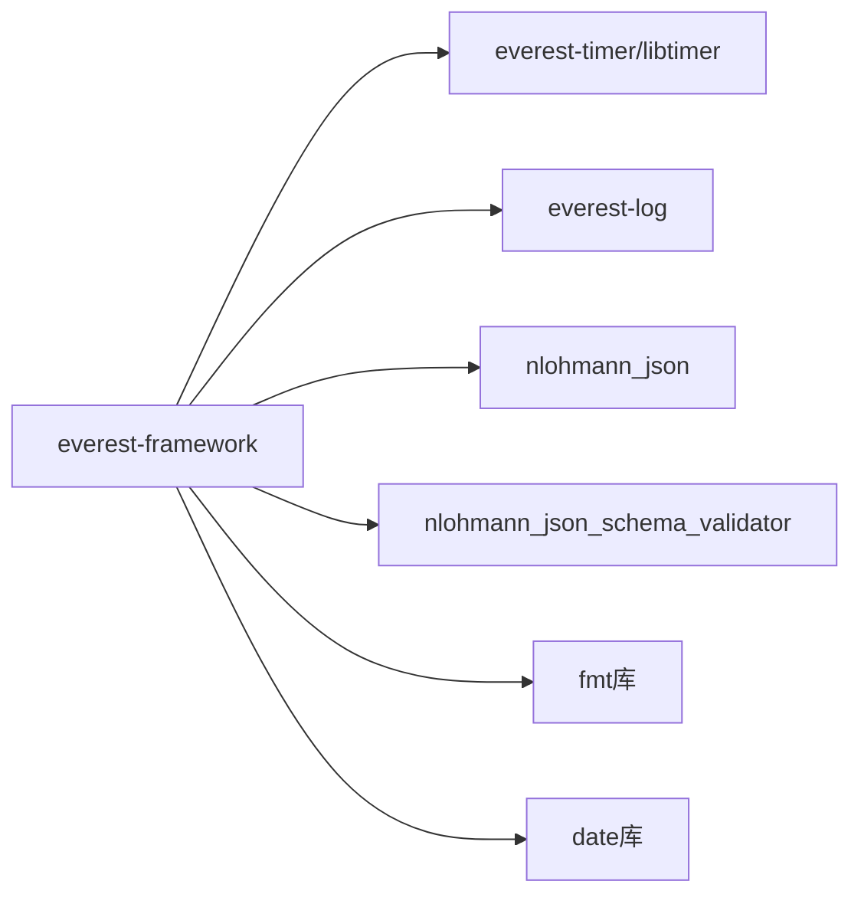

# 项目概述

libtimer 是 EVerest 项目的一个组件，主要==提供定时器功能==。EVerest 是一个开源的电动汽车充电站操作系统。libtimer 是一个相对独立的库，主要目的是为了支持==日志文件回放==功能：

```md
C++ timer library for the EVerest framework
===========================================
EVerest is aiming to enable logfile replay. All EVerest components have to utilize this library for time (and delay) related things in order to enable accelerated logfile replay speed in the future.

All documentation and the issue tracking can be found in our main repository here: https://github.com/EVerest/everest


```

# libtimer 测试代码分析

从测试代码 <mcfile name="libtimer_unit_test.cpp" path="d:\Code\github\EVerest\libtimer\tests\libtimer_unit_test.cpp"></mcfile> 中，可以看到：

1. 该库使用 Google Test 框架进行单元测试
2. 测试类 `LibTimerUnitTest` 继承自 `::testing::Test`
3. 包含标准的 `SetUp` 和 `TearDown` 方法
4. 目前只有一个简单的示例测试用例 `just_an_example`

# 与 everest-framework 的集成

从 [[./EVerest-framework|EVerest-framework]] 的 `Cmakelists.txt` 中，我们可以看到 libtimer 与 EVerest-framework 的关系：

1. EVerest-framework 依赖于 EVerest-timer（即 libtimer）
2. 在 CMake 配置中，EVerest-framework 将 EVerest-timer 作为必需的依赖项
3. 在打包时，EVerest-framework 会包含对 EVerest-timer 的依赖声明



# libtimer 功能

libtimer 是一个接口库（interface library），是一个纯头文件库（header-only library），实现代码都在头文件 `timer.hpp` 中。这种设计方式在C++中很常见，特别是对于模板库来说，因为**模板必须在编译时可见**。

## `timer.hpp`

这是一个基于3.4C++模板的计时器类，默认使用`date::utc_clock`作为时钟类型：

```16:17:libtimer/include/everest/timer.hpp
// template <typename TimerClock = date::steady_clock> class Timer {
template <typename TimerClock = date::utc_clock> class Timer {
```

### 主要成员变量

- `timer`: ASIO的定时器对象
- `callback`: 用户定义的回调函数
- `callback_wrapper`: 用于 interval 模式的包装回调函数
- `io_context`: boost::asio的IO上下文
- `timer_thread`: 定时器线程指针

### 构造函数

类提供了四个构造函数：

- 默认构造函数：创建自己的 io_context 和线程
- 带回调函数的构造函数：创建自己的 io_context 和线程
- 使用外部 io_context 的构造函数
- 使用外部 io_context 和回调函数的构造函数

### 主要功能方法

- `at()`: 在指定时间点执行回调
- `interval()`: 按指定时间间隔周期性执行回调
- `timeout()`: 在指定延时后执行一次回调
- `stop()`: 停止定时器

### 别名

类提供了两个别名：

```180:181:libtimer/include/everest/timer.hpp
using SteadyTimer = Timer<date::utc_clock>;
using SystemTimer = Timer<date::utc_clock>;
```

### 主要特点

1. 基于boost::asio实现，支持异步操作
2. 支持自管理和外部管理两种IO上下文模式
3. 提供了精确的时间控制功能
4. 线程安全设计
5. 支持多种时间点和时间间隔的表示方式
6. 可以方便地用于日志回放功能，这也是该库的主要目的

使用示例可以参考examples/main.cpp，其中展示了如何使用at、interval和timeout等功能。这个库的设计非常灵活，既可以独立使用，也可以集成到使用boost::asio的更大系统中。

### 代码解读

以`at`函数为例：

```c
	/// Executes the given callback at the given timepoint
    template <class Clock, class Duration = typename Clock::duration>
    void at(const std::function<void()>& callback, const std::chrono::time_point<Clock, Duration>& time_point) {
        this->stop();

        this->callback = callback;

        this->at(time_point);
    }

    /// Executes the at the given timepoint
    template <class Clock, class Duration = typename Clock::duration>
    void at(const std::chrono::time_point<Clock, Duration>& time_point) {
        this->stop();

        if (this->callback == nullptr) {
            return;
        }

        if (this->timer != nullptr) {
            // use asio timer
            this->timer->expires_at(time_point);
            this->timer->async_wait([this](const boost::system::error_code& e) {
                if (e) {
                    return;
                }

                this->callback();
            });
        }
    }
```

这段代码定义了一个定时器类中的两个 at() 方法，用于在指定的时间点执行回调函数。

```c
template <class Clock, class Duration = typename Clock::duration>
```

这一行声明了一个模板函数，**可以接受不同类型的时钟和时间间隔**。

```cpp
void at(const std::function<void()>& callback, 
		const std::chrono::time_point<Clock, Duration>& time_point )
```

第一个参数 `const std::function<void()>& callback：`

- `std::function<void()>` 是一个函数包装器，可以存储任何无参数、无返回值的可调用对象（函数、lambda表达式等）
- const 表示这个参数不会被修改
- 1.15C++引用 表示通过引用传递，避免复制开销

第二个参数 `const std::chrono::time_point<Clock, Duration>& time_point：`

- `std::chrono::time_point` 是C++标准库中表示时间点的类型
- Clock 是模板参数，指定使用哪种时钟（比如系统时钟或稳定时钟）
- Duration 是时间精度的类型（如纳秒、微秒等）
- const 和 & 的含义同上

### 为什么要使用模板实现

#### 灵活性和可扩展性

```16:17:libtimer/include/everest/timer.hpp
// template <typename TimerClock = date::steady_clock> class Timer {
template <typename TimerClock = date::utc_clock> class Timer {
```

从代码中可以看到，Timer类默认使用`date::utc_clock`作为时钟类型，但通过模板参数可以灵活地更换其他时钟类型。这种设计允许用户根据需要选择不同的时钟实现，比如：

- `date::steady_clock`：单调递增时钟
- `date::utc_clock`：UTC时钟
- `std::chrono`中的其他时钟类型

timer是如何通过模板实现自动适配不同时间类型

#### 类型安全

```69:76:libtimer/include/everest/timer.hpp
    template <class Clock, class Duration = typename Clock::duration>
    void at(const std::function<void()>& callback, const std::chrono::time_point<Clock, Duration>& time_point) {
        this->stop();

        this->callback = callback;

        this->at(time_point);
    }
```

在`at()`方法中使用模板参数`Clock`和`Duration`，这样可以：

- 在编译时确保时间点类型的正确性
- 支持不同精度的时间单位（如秒、毫秒、微秒等）
- 避免运行时类型转换带来的开销

#### 通用性

```101:108:libtimer/include/everest/timer.hpp
    template <class Rep, class Period>
    void interval(const std::function<void()>& callback, const std::chrono::duration<Rep, Period>& interval) {
        this->stop();

        this->callback = callback;

        this->interval(interval);
    }
```

`interval()`方法使用模板参数`Rep`和`Period`，这使得函数可以接受任何符合`std::chrono::duration`概念的时间间隔类型，比如：

- `std::chrono::seconds`
- `std::chrono::milliseconds`
- 自定义的时间单位

#### 日志回放功能

```2:3:libtimer/README.md
===========================================
EVerest is aiming to enable logfile replay. All EVerest components have to utilize this library for time (and delay) related things in order to enable accelerated logfile replay speed in the future.
```

从README可以看出，这个库的主要目的是支持日志回放功能。使用模板可以让时钟类型可配置，这样在回放模式下可以使用模拟时钟来加速或减速时间流逝，而在正常模式下使用实际的系统时钟。

#### 性能优化

- **模板代码在编译时展开，没有运行时开销**
- 编译器可以针对具体的时钟类型进行优化
- 避免了虚函数调用和类型擦除带来的性能损失

通过使用模板，这个Timer类实现了高度的灵活性和类型安全，同时保持了良好的性能，这对于需要精确时间控制的EVerest框架来说是非常重要的。
