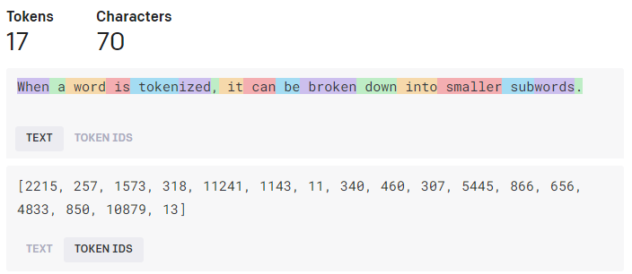
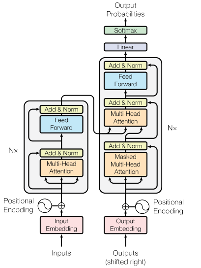
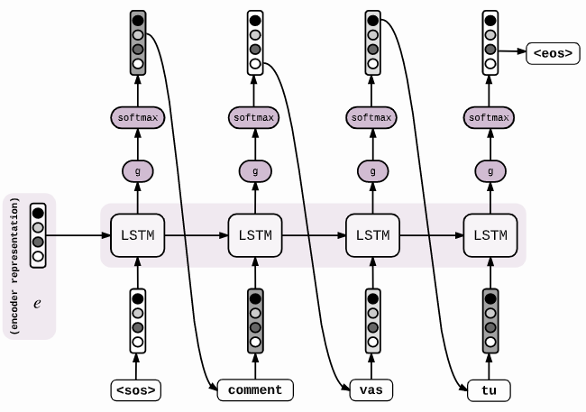
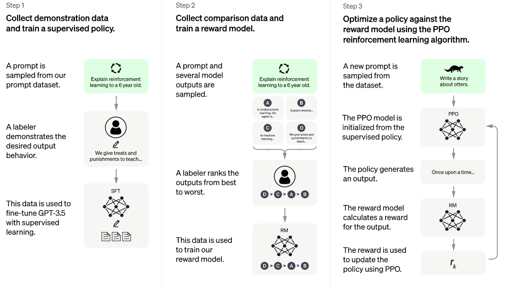

> [!info] Pour information
>
> Ce post est adapté d'un devoir de L1 sur le thème "Informatique et langue naturelle"

# Principe général de ChatGPT

ChatGPT fait partie des modèles génératifs d'intelligence artificielle (_large generative AI_), et est en particulier un modèle de "Text-to-text". Il intéragit avec l'utilisateur-ice sous forme de conversation, d'où le nom _chat_, en conservant les informations échangées pour formuler ses réponses.[^1]

Les utilisations de ChatGPT sont diverses, on peut notamment citer la traduction, la rédaction de textes avec un style prédéfini ou bien encore la création et le debug de code informatique.[^2]

Pour fonctionner, ChatGPT utilise le principe du _machine learning_ et en particlier du _deep learning_ (Figure 1). Le _machine learning_ consiste à transformer une donnée brute en une représentation interne qui peut être interprétée par une machine, puis être classée selon sa nature. Le _deep learning_ se base sur les méthodes d'apprentissage par représentation (_representation learning_) qui permettent à une machine de calculer automatiquement les représentations nécessaire à la classification des données brutes fournies en entrée. Plus précisément, le _deep learning_ appliquent les méthodes d'apprentissage par représentation sur plusieurs niveaux : la donnée brute est convertie en une représentation dite de niveau "supérieur" qui elle-même va être convertie en une représentation de niveau supérieur, et ainsi de suite. [^3]

*Figure 1 : Diagramme en cercles représentant la place du machine learning et du Deep learning dans l’intelligence artificielle [^4]*

Le _deep learning_ correspond à un empilement de **réseaux de neurones** (_neural networks_), qui classifient les données en entrées pour les traduire en vecteurs (donc en données numériques) [^5].  Ces couches de réseaux de neurones sont constituées de **nœuds**, là où s'effectue un calcul quand un "stimulus" (les données en entrée) suffisant lui est donné. Pour calculer si ce stimulus est suffisant, à la manière d'un neurone humain, le nœud attribue différents poids (ou coefficients) aux entrées selon leur importance dans la tâche à effectuer. Ces coefficients sont additionnés, transmis à la fonction d'activation du nœud, et si le signal passe, le neurone est "activé". (Figure 2)

*Figure 2 : Représentation schématique d'un neurone dans un réseau de neurones*

Les outils d'intelligence artificielle comme ChatGPT utilisent des réseaux de neurones particuliers : les **réseaux de neurones récurrents** (_recurrent neural network_). Ces réseaux de neurones diffèrent des autres réseaux artificiels car ils gardent en mémoire les entrées précédentes, et celles-ci influent sur leurs réponses (Figure 3). Cela est particulièrement utile pour les intelligences artificielles, comme ChatGPT, qui effectuent un traitement du langage naturel (_natural language processing_) puisqu'une phrase n'a de sens que dans son contexte, donc un mot doit être analysé en considérant les précédents mots. [^6]

*Figure 3 : Schéma des réseaux de neurones (_Feed-forward network_) et des réseaux de neurones récurrents (_Recurrent network_). Les couches _hidden_ sont les couches de neurones masquées. [^7]*

Ainsi, ChatGPT utilise des réseaux de neurones afin de formuler ses réponses. Ceux-ci prennent en compte le contexte, et sont donc particulièrement adaptés à la compréhension du langage naturel.

# Architecture de ChatGPT

ChatGPT utilise donc un réseau de neurones récurrents, le réseau GPT-3.5 avec 175 milliards de poids. Celui-ci a été conçu pour traiter le langage naturel, et comporte un élément, le "transformateur" (_transformer_) qui lui permet d'améliorer ses capacités. [^8]
Ces transformateurs définissent des régions du texte qui sont considérées comme celles auxquelles il faut prêter une plus grande "attention" (_self-attention_). Ces régions sont appelées des symboles (_tokens_), ce sont les séquences communes de caractères dans un texte  (Figure 4)

*Figure 4 : Exemple de symboles calculés à partir d'une phrase, et de leurs identifiants associés [^9]*

La Figure 4 montre aussi l'étape dite "d'intégration" de ces symboles, qui sont convertis en valeurs numériques. Cette étape d'intégration permet de voir les relations entre différents mots : des mots proches, dans leur construction ou leur sens auront des nombres d'intégration proches. Ces vecteurs, qui contiennent donc les nombres d'intégrations des mots, sont l'entrée initiale de ChatGPT. La Figure 5 explique les différentes étapes du transformateur utilisé dans ChatGPT.

*Figure 5 : Architecture du modèle Transformer [^10]*

En plus du principe d'auto-attention, le transformateur utilise des couches d'attention multi-têtes (_multi-head attention_) qui permettent une représentation plus riche des relations entre les mots. Ces couches consistent en un assemblage de différentes couches d'attention [^10] (qui calculent des vecteurs numériques en fonction de l'entrée, comme évoqué précédemment). Aussi, le modèle _Transformer_ utilise à la fois un encodeur et un décodeur. L'encodeur traite la séquence d'entrée pour extraire les informations contextuelles, tandis que le décodeur génère la séquence de sortie mot par mot en utilisant les informations de l'encodeur et les mots précédemment générés.

Le modèle transformateur de ChatGPT est initialisé avec des poids aléatoires, puis est _entraîné_ (comme tout modèle d'intelligence artificielle) à partir de données, et cet entraînement est un apprentissage _supervisé_.[^10]

# Entraînement de ChatGPT

L'entraînement de ChatGPT s'effectue d'abord en exposant le réseau de neurones à une grande quantité de données textuelles, en utilisant l'apprentissage supervisé, provenant de différentes sources (Tableau 1). Celles-ci sont des livres, des pages web, des articles de magazine ou encore des conversations, ce qui permet à ChatGPT de ressembler à des conversations entre humain-es [^11].

| Jeu de données | Nombre de symboles | Poids dans le jeu d'entraînement final |
| -- | -- | -- |
| Common Crawl | 410 milliards | 60% |
| WebText2 | 19 milliards | 22% |
| Books1 | 12 milliards | 8% |
| Books2 | 55 milliards | 8% |
| Wikipedia | 3 milliards | 3% |

*Tableau 1 : Jeux de données utilisés lors de l'entraînement de ChatGPT [^11]*

L'apprentissage supervisé consiste à entraîner un modèle en lui fournissant des données d'entrées et des données de sorties attendues [^12]. Par cette première étape de l'entraînement, les poids du modèle _Transformer_ peuvent être recalculées (en utilisant un algorithme d'optimisation, tel que l'optimisateur Adam utilisé pour ChatGPT [^11]).

Des calculs intermédiaires sont également effectués, notamment le calcul de la perte pour quantifier l'écart entre les prédictions du modèle et les sorties attendues, ainsi que le calcul de rétropropagation du gradient qui indique la direction et l'amplitude du changement à apporter aux paramètres du modèle pour réduire la perte [^13].

Ces différentes étapes de calcul sont répétées sur de nombreux exemples et avec plusieurs itérations, afin d'ajuster les poids du modèle de plus en plus précisément. Le modèle est ainsi utilisable et peut donc générer du texte en sortie qui correspondra à l'entrée (souvent nommé _prompt_).

# Fonctionnement de la génération de texte

ChatGPT est un modèle de texte autorégressif, c'est-à-dire qu'il utilise un réseau de neurones pour attribuer des poids (des probabilités) à des mots (ou des parties de mots, les symboles), et il utilise ces probabilités pour générer les mots, les uns à la suite des autres.

La génération de texte s'effectue en utilisant le modèle transformateur (_Transformer_), et surtout le principe d'attention. La Figure 6 montre une génération de texte sans prinipe d'attention et la Figure 7 avec principe d'attention, expliqué précédemment.

*Figure 6 : Schéma du décodeur sans attention pour générer des mots [^14]*

*Figure 7 : Schéma du décodeur avec attention (du type _Transformer_) pour générer des mots [^14]*

ChatGPT génère donc du texte de manière _itérative_, en utilisant les probabilités conditionnelles du modèle qui ont été affinées lors de l'entraînement, et en considérant le contexte grâce au principe d'attention.

ChatGPT utilise également un processus appelé _Beam Search_ (recherche par faisceau), qui permet de minimiser les erreurs lors du décodage. En effet, même après avoir entraîné le modèle, il est possible qu'il y ait des erreurs, et qu'un mot ne correspondant pas au contexte soit privilégié par rapport à un autre qui correspondrait.
Le principe de _Beam Search_ permet d'effectuer avec une plus grande efficacité le décodage. Au lieu de prédire uniquement le symbole avec la probabilité la plus élevé, le modèle peut garder une trace de $k$ mots probables ($k$ est la taille du _beam_, ou taille du faisceau). Ainsi, à chaque nouveau symbole généré, il existe $V$ nouveaux symboles possible pour les $k$ possibilités. Donc, il y a un total de $k*V$ possibilités de générations. Le modèle conserve uniquement les $k$ meilleures (Figure 8), et répète ce mécanisme pour les autres symboles. [^14]

Cela permet  de générer les _séquences de mots les plus probables_ et non plus uniquement les _mots_ les plus probables, ce qui améliore l'efficacité liée au contexte.

Enfin, ChatGPT peut être spécialisé dans certaines tâches ou certains domaines (par exemple la génération de code), en utilisant le _fine-tuning_ (ajustement fin) dans le cadre du _Reinforcement Learning from Human Feedback_ (Apprentissage par renforcement à partir de commentaires humains) qui permet d'optimiser directement un modèle linguistique avec un retour d'information humain [^15]. Cet apprentissage par renforcement s'effectue en 3 étapes (Figure 8) :

1. Pré-entraînement d'un modèle linguistique
2. Collecte de données et l'entraînement d'un modèle de récompense (_reward model_)
3. Affinage du modèle linguistique (_fine tuning_) par l'apprentissage par renforcement.

*Figure 8 : Etapes d'entraînement de ChatGPT lors d'un apprentissage par renforcement [^1]*

Le modèle de récompense, qui est également un modèle de langage constitué d'un réseau de neurones, est entraîné à partir des instructions données par les utilisateurs-ices de ChatGPT. Les textes générés par ChatGPT sont classés par des humains, par exemple en demandant aux utilisateurs-ices de comparer le texte généré par deux modèles linguistiques conditionnés par la même instruction de départ (Figure 9).

*Figure 9 : Schéma du modèle de récompense [^15]*

Afin d'affiner le modèle de langage, une copie de ce modèle initial est effectuée en utilisant un algorithme de _Reinforcement learning_ (l'algorithme de _Proximal Policy Optimization, PPO_) et en fixant les paramètres du modèle.

Les deux modèles, celui initial et celui généré grâce à la _PPO_ produisent une sortie textuelle à partir d'une entrée. Les deux sorties sont comparées, et une pénalité $\lambda_{r_{KL}}$ (_Kullback–Leibler prediction shift penalty_) est appliquée si la sortie du modèle affiné est trop éloignée de celle du modèle initial, et en perd donc son sens. La sortie du modèle affiné est évaluée par le modèle de récompense qui calcule un scalaire de "préférence" $r_{\theta}$. Le modèle affiné peut être mis à jour avec les données calculées qui sont $r = r_{\theta} - \lambda_{r_{KL}}$ (Figure 10)

*Figure 10 : Schéma de l'apprentissage par renforcement [^15]*

Cette technique de renforcement permet donc à ChatGPT de se spécialiser dans certaines tâches, en considérant des connaissances externes, notamment fournies par les utilisateurs-ices de ChatGPT.

[^1]: OpenAI, "Introducing ChatGPT", 2022. [lien](https://opennai.com/blog/chatgpt)
Bibliographie
[^2]: R. Gozalo-Brizuela, and E. C. Garrido-Merchan,"ChatGPT is not all you need. A State of the Art Review of large Generative AI models", 2023, doi: 10.48550/ARXIV.2301.04655.
[^3]: Y. LeCun, Y. Bengio, and G. Hinton, "Deep learning", Nature, vol. 521, no. 7553, pp. 436–444, May 2015, doi:10.1038/nature14539.
[^4]: IONOS, "Quelles sont les différences entre le Deep
learning et le Machine learning ?", 2020. (<https://www.ionos.fr/digitalguide/web-marketing/search-engine-marketing/deep-learning-vs-machine-learning/>)
[^5]: C. Nicholson, "A Beginner's Guide to Neural Networksand Deep Learning", 2023. (<http://wiki.pathmind.com/neural-network>)
[^6]: IBM, "What are Recurrent Neural Networks? | IBM", 2023. (<https://www.ibm.com/topics/recurrent-neural-networks>)
[^7]: P. Baheti, "The Complete Guide to Recurrent Neural
Networks.” (<https://www.v7labs.com/blog/recurrent-neural-networks-guide>)
[^8]: S. Wolfram, "What Is ChatGPT Doing and Why Does It Work?", 2023. (<https://writings.stephenwolfram.com/2023/02/what-is-chatgpt-doing-and-why-does-it-work/>)
[^9]: OpenAI, "Tokenizer.” (<https://platform.openai.com/tokenizer>)
[^10]: A. Vaswani, N. Shazeer, et al., "Attention Is All You Need", arXiv, 2017.
[^11]: T. B. Brown, B. Mann, et al., "Language Models are Few-Shot Learners", arXiv, 2020.
[^12]: DeepAI, "Supervised Learning", 2019. (<https://deepai.org/machine-learning-glossary-and-terms/supervised-learning>)
[^13]: D. E. Rumelhart, G. E. Hinton, and R. J. Williams, "Learning representations by back-propagating er-rors", Nature, vol. 323, no. 6088, pp. 533–536, Oct. 1986, doi: 10.1038/323533a0.
[^14]: G. Genthial, "Seq2Seq with Attention and Beam Search", 2017. (<https://guillaumegenthial.github.io/sequence-to-sequence.html>)
[^15]: N. Lambert, L. Castricato, L. von Werra, and A. Havrilla, "Illustrating Reinforcement Learning fromHuman Feedback (RLHF)", 2022. (<https://hugging-face.co/blog/rlhf>)
