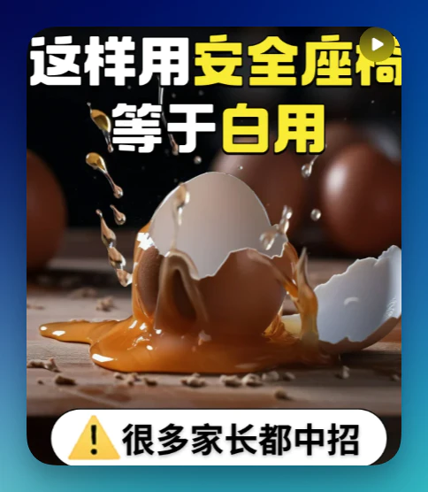

  
### 批注  
> 内容的本质是信息，内容要达成的目的是吸引人们花时间和花钱。 ^ce31329c  
  
> 第一层的衡量指标是打开率和浏览量，第二层的衡量指标是完播率、互动率和转化率，这两层指标之积，即是评判内容好坏的标准。 ^cb7e3d3e  
  
> 打开率和浏览量由内容的封面、标题、选题和所推送的人群精准度决定；完播、互动和转化由选题和内容文本质量决定。 ^859dc5a7  
  
> 购买他的付费内容，我实际上是在购买一种陪伴、一种鼓励。 ^b1528f8e  
  
> 若想在内容创作这条路上走得更远，我们**应当读更多底层学科的图书论文，而不是止于市面上的教程内容。** ^3ca954af  
  
> 前方的道路并不拥挤，因为坚持的人并不多。 ^afbfe619  
  
```query  
/==.*?==/   
path:"做了 4 年短视频内容，我想和你分享这些心得方法"  
  
```  
---  
# 做了 4 年短视频内容，我想和你分享这些心得方法 - 少数派  
  
**Matrix 首页推荐**   
  
[Matrix](https://sspai.com/matrix) 是少数派的写作社区，我们主张分享真实的产品体验，有实用价值的经验与思考。我们会不定期挑选 Matrix 最优质的文章，展示来自用户的最真实的体验和观点。   
  
文章代表作者个人观点，少数派仅对标题和排版略作修改。  
  
---  
  
在过去的 4 年里，我一直在负责创作知识 IP 的短视频内容，在抖音、视频号和小红书，都做出过百万、千万级别的爆款内容。  
  
趁在家休息的机会，我想通过写作的方式，把我这几年的经验和思考，做个阶段性的梳理和沉淀，于是有了这篇文章。  
  
我会在这篇文章里，**厘清内容的定义和目的，继而围绕内容创作的目的，来梳理做内容的一些心得方法。**  
  
## 一、内容的定义和目的  
  
我对内容的定义和目的的理解，来自于黄章晋的《成为内容高手》，这是到目前为止，对我做内容启发最大的专栏课程。  
  
黄章晋老师，是一位资深的媒体人，最早在传统媒体工作，在新媒体浪潮掀起后，成功转型创办了「大象公会」，他和他的团队创作了非常多 10w+ 的内容，既有文字的，也有视频的，可以说他对内容的理解和把握是十分到位的。  
  
他在《成为内容高手》中说：  
  
> 内容，不管它具体是什么形式，本质上都是**信息**，只不过他是**有意识被生产**出来，是希望人们愿意**花费时间**和**金钱**获取的信息。  
  
我做个精简，他说：**==内容的本质是信息，内容要达成的目的是吸引人们花时间和花钱。==**  
  
或许你也知道，国内外的内容平台，不论是抖音、视频号、小红书，还是 X、Youtube、Facebook，实际上都把**「用户停留时长」**作为评判内容好坏的重要依据。因为要靠内容赚钱的前提是，先让内容吸引住用户花些时间，停留下来。  
  
**每一个内容平台，和内容创作者、内容消费者，都是一个三角利益共生的关系。**平台要构建一个良好的生态，激励内容创作者持续生产优质内容，满足消费者的需求，让消费者停留、付费，平台和创作者则从消费者的付费中，获取对应的收益。  
  
内容平台永远都希望创作者都能够创作出最优秀的内容，帮助平台一起盈利。当然这个前提是，创作者不做违反政策条例的内容，确保平台能够在规则之内存活。简单说，内容平台，既是搭场子的人，也是监管人，一个永远希望你遵守规则且持续盈利的角色。  
  
我们作为内容创作者，只需要不做违反政策法规的事，专注如何做出让用户愿意花时间和金钱的内容就好，或者说**应该聚焦如何让自己的内容创作达成目的，而不必一直怀疑自己的内容是否被平台所限制。**  
  
## 二、让内容达成目的  
  
相比较文章和播客，视频的内容元素是最多的，不仅需要构思选题、文本、封面、标题，还需要思考如何以契合当下热潮、符合用户期待、匹配文本情绪的画面来呈现。  
  
因为我对拍摄和剪辑并不擅长，在这里，我只对我所熟悉的选题、封面、标题和文本，做一些总结，以让内容有更好的传播度，吸引更多消费者停留花费时间。  
  
继而讲讲在这四个元素的之外，通过哪些做法，可以更好地获得用户的信任，从而让用户愿意为内容花费金钱。  
  
### 1、让用户愿意花时间  
  
让用户愿意花时间，首先要让用户点开内容，再尽可能地让用户看完内容。在运营的视角上，所有内容，从曝光到观看再到行为的发生（如点赞、收藏、评论、关注、付费），都是一个二层漏斗。  
  
第一层是从曝光到打开浏览；第二层是从浏览到行为发生，也就是停留、互动、关注和转化。  
  
==第一层的衡量指标是打开率和浏览量，第二层的衡量指标是完播率、互动率和转化率，这两层指标之积，即是评判内容好坏的标准。==  
  
**==打开率和浏览量由内容的封面、标题、选题和所推送的人群精准度决定；完播、互动和转化由选题和内容文本质量决定。==**  
  
或许有人会疑惑，以抖音和视频号为代表的这类信息流内容产品，用户在刷的过程中看不到封面，怎么能说封面影响内容的打开率和浏览量呢？确实，在信息流类的产品里，封面对打开率的作用只体现在用户点进账号的主页的情况。由于前文已经说明，这篇文章聚焦选题、封面、标题和文本，视频的拍摄和剪辑画面不作讨论，在这里我统一把信息流类视频的前三秒也看作是封面。  
  
清楚了内容好坏的标准，就有了生产优质内容的方向，**一是让更多用户打开内容，而是让用户更加愿意看完内容。**  
  
#### 1.1 让用户打开内容  
  
我一直认为封面和标题是否勾起用户打开的欲望，表面是由「如何做出更吸睛的封面和标题」这类技法决定的，背后则是由「选题」和「选题面向的人群是否精准」决定的。  
  
**选题**  
  
所以我先说选题，选题也是我认为对内容传播影响最大的因子。什么样的选题效果最好？我归结为以下几点：  
  
**1、覆盖足够多的人群**  
  
一个讲述「如何用三个月赚取 100w 元」的视频，和一个讲述「如何用三个月快速提升摄影技术」的视频相比，前者的覆盖人群一定会更广，在相同情况下，前者的传播面也会更广。  
  
判断选题覆盖人群是否够广的方法，精细的可以用关键词在微信指数上查找对比热度；粗糙的可以依靠自己的经验判断受众人群体量，大体上限制条件越多的选题，受众人群越窄。  
  
**2、解决重要或紧迫的问题**  
  
比如：「不想家人得癌症，别碰这几样」，癌症预防的话题足够重要。又比如：「暖宝宝这么贴，衣服都能少穿两件」，在冬天，如何保暖的问题也足够紧迫。这类重要或紧迫的问题，大众的关注度足够高，在传播上就更加有优势。  
  
**3、反常规反认知**  
  
这类选题满足用户的好奇和赞慕，如「一位穿着朴素的农村大妈竟然可以说一口地道的英语」。  
  
**4、洞察社会的情绪**  
  
这类选题把目前社会上已有的情绪，给提炼点明，从而和用户达成一种共鸣。  
  
如「春节假期结束，年轻人陆续离家，心疼留守老人的情绪」，又比如「不婚主义者，在朋友结婚时的是否要包红包的犹豫情绪」。  
  
**5、紧跟时事热点**  
  
不必多言，即便包括我在内的许多创作者并不喜欢做这类内容，但是效果却总是很好。  
  
**封面和标题**  
  
封面和标题的具体技法作用，就体现在如何把上述本就不错的选题，体现出最大的吸引力。打开率高的封面，通常需要有很好的视觉冲击力，也能和标题形成一种联系感，但又不让人反感害怕。  
  
我以下面这幅封面图为例，标题是「这样用安全座椅等于白用」，封面是一个有冲击感的破碎的鸡蛋，它既能让用户通过联想把它和安全座椅、车祸相联系，又避开了血腥的场面。效果是不错的。总结起来，一个好的封面 = 视觉冲击力 + 紧扣标题 + 不让人瘆得慌。  
  
  
  
来自网络  
  
至于标题怎么写，网上有许多教程可以找到，不过**我更建议你在自己要重点发力的内容平台上，收集优秀的参考案例来分析和学习，尤其是那些刚刚启动成功的账号。**在这里，我仅罗列几个常用到的标题方法：  
  
1. 营造冲突感：我北大毕业，在做保洁……  
2. 提供实用感：暖宝宝这么贴，衣服都能少穿两件  
3. 代入共鸣感：我勤勤恳恳念完大学，却找不到工作……  
4. 满足好奇心：工作 5 年，存下了第一个百万，我是怎么做到的？  
  
**人群精准度**  
  
再说让内容被推向精准的人群，这看似由平台控制的，实际上是由账号一直发布的内容分类和风格所控制的。许多人都建议大家专注于一个垂直领域做内容，这可以让用户点进主页后更好地关注，这话不假。  
  
不过，我想补充另一个视角，**内容选题的一致性，以及每一个内容的文本、封面、标题和标签，实际上都在告诉平台的算法，你的内容聚焦在哪个分类，你的内容面向哪类人群。**  
  
当算法对你有了足够的了解后，才可以更加精准地把你的内容推送给你要面向的人群。当内容被推向更加精准的用户，结果就是内容打开率和浏览量的效果会更好。  
  
或许你也听说过，「复刻同行的爆款视频内容，是做爆款的最好方式」。但在实际过程中却有很大的差异，这一方面受制于内容算法的随机性，另一方面即是你所找到的爆款同行内容和你过往的内容风格以及面向的人群有很大的差异。  
  
比如一个面向下沉群众的清单罗列式的单薄爆款内容，在一个面向一二线用户的硬核知识博主的账号上就行不通。  
  
#### 1.2 让用户看完内容  
  
当选题、封面、标题和面向的人群精准度，解决了打开率和浏览量的问题，接下来就需要选题和文本起作用，让用户尽量停留更多的时间，并采取互动、关注或转化的行为。  
  
为什么在这里还要提选题，是因为在实际的创作分发过程中发现，在相同浏览量情况下，**负面危害向的选题，总是比正面安利向的选题，有更好的互动和关注表现。**  
  
不过在这一部分，更多还是聚焦在内容文本上，文本有以下三点需要注意：  
  
**符合用户预期**  
  
被大家诟病的标题党，本质是标题和内容文本的不匹配，导致虎头蛇尾，不符合用户的预期，其结果是第一层漏斗数据很好，第二层漏斗出现断崖式下降，留存效果差。  
  
要避免这种情况，就要让内容文本和选题、封面、标题做好承接。举例来说  
  
* 一个讲解决办法的封面标题，文本就应当聚焦给出解决方案；  
* 一个讲为什么的封面的标题，文本就应当聚焦给出原因分析；  
* 一个讲如何吃饭更容易瘦身的视频，就应当从吃饭开始讲，而不是从穿着开始讲；  
* 一个讲农村大妈说一口流利英语的视频，就直接展示她说英语的画面；  
* ……  
  
这些就叫符合用户的预期。  
  
**为用户提供价值**  
  
接住了用户的期待，还需要在视频里为用户提供价值，**什么是价值？我认为可以是拿来就能用的方法，可以是明确笃定的观点，也可以是一段出糗的经历，让用户带走一个技巧、带走一个说法、带走一点快乐，不虚此次的打开和停留，就是价值。**  
  
由于我过去做的内容都是知识类的，所以这类内容，还特别讲究是否提供了新的信息增量，但这并不说一个视频里必须都是鲜为人知的知识，而是说**在内容的节奏排布上应该让有信息增量的小点优先放置在前，大众熟知的放置在后**，从而有更多的留存。  
  
**用易懂的表达**  
  
我们要让内容拥有更高的传播度，就等于要让内容面向更广泛的人群，这意味着我们的内容文本，**要用最通俗易懂的，有对话感的语言来表达，有逻辑且直接。**  
  
我们要避免用高大上的概念，因为我们都不是罗振宇老师，没有造词的能力；我们避免用说教的方式，因为所有人都不爱被说教，更喜欢被平等对待；我们要避免绕弯子，因为用户的耐心有限。  
  
### 2、让用户愿意花钱  
  
当我们已经把封面、标题、选题和文本的工作做到了不错的效果，已经让用户愿意花费时间观看之后，要考虑的问题，就变成了如何让用户愿意花钱。  
  
为一个人或一个产品掏钱背后的原因，几乎都可以概括为：**我信任这个人或这个产品能够为我提供价值，满足我的需求。**这个需求，有的是工具型的，如一种技能习得，有的是情绪型的，如一种社群陪伴服务。  
  
不论我们的内容提供哪种类型的价值，其核心都是**要在用户心理建立起信任，才能获得金钱。**如何通过内容在用户心中建立起信任？我总结为以下三点。  
  
#### 2.1 保持一致  
  
保持一致，是指持续在一个领域创作内容，不断精进到成为这个行业的 Top，直到你能够代表一个品类。正如影视飓风代表了摄影技术，丁香医生代表了医学百科。  
  
当你有了摄影问题，可以直接到影视飓风的账号搜索，当你有了医疗问题，可以直接找丁香医生。  
  
或许你也发现了，这些**成为一个品类代表的创作者，正如品牌一样**，已经在用户心中打下来深深的烙印，而人们对这些创作者的信任就是来自于他们始终如一的领域耕耘，且保持较高的内容创作水准。  
  
当他们开始做商业化的内容产品的时候，大概率要比其他非品类代表创作者的效果更好。  
  
#### 2.2 做到专业  
  
保持一致，是指持续在一个品类下创作。做到专业，是指在这个领域里要持续精进，在内容上要展示出你在这一领域的擅长优势。  
  
这种专业，是货真价实的专业，一个判断的方法是，我们所做的内容，是否有客观的科学依据，又或者是否来自于亲身的体验，以及真正能够让这些内容发挥价值，帮助用户解决一个问题。  
  
目前来看，我们大部分用户依然强调实用为先，希望付费内容为自己带来某种解决方案的，多过于希望付费内容带给自己的情绪价值，这就是做到专业的意义，化身为用户的顾问老师。  
  
#### 2.3 始终真诚  
  
**专业，不是人人都能做到，但真诚是所有人都拥有，且是所有人都想得到的。**  
  
我对真诚的理解是，**始终认真踏实地对待自己的内容**，让用户透过我们的内容感受到我们的生命力，感受到我们的用心，甚至感受到我们在急他之所急，从而感到踏实放心。  
  
以我自己举例，当我看到诸如「2024 年的机会在哪里」「现在还 All in XX，你活该倒闭」这类标题内容的时候，我会立刻滑走，因为这类同质化的内容，大概率都是夺人眼球的幌子。  
  
相反，我特别喜欢的一个创作者，叫 happy xiao，一个在上海外企做销售的中年大叔，不擅长写作却在持续写，即便写得不算好，我也愿意为他付费。我当然无法在他身上学到专业的销售知识、写作方法，但是我能在他身上感受到真诚、真实和坚持。  
  
我的写作之路，很大程度上受他的影响而开启，**==购买他的付费内容，我实际上是在购买一种陪伴、一种鼓励。==**  
  
当我们还不具备一个领域的专业知识的时候，至少先做到真诚，即便内容蹩脚一点，也不要试图蒙骗用户。只要我们做到真诚地分享所思所想，一样能获得同路人的关注和付费，大家愿意看我们从蹩脚到熟练，只是这条路或许慢一点。  
  
## 三、最后  
  
很开心，花了一周的时间，终于写完了这篇谋划近半年的内容沉淀文章，于我而言既是一个收尾，也是一个开始。  
  
在这里，我还想补充一点，内容创作和产品设计一样，我们都致力于如何挖掘和满足用户的需求，这背后的底层学科是脑科学、认知心理学、传播学。  
  
==若想在内容创作这条路上走得更远，我们==**==应当读更多底层学科的图书论文，而不是止于市面上的教程内容。==**  
  
最后借用 flomo 联合创始人的一句话，鼓励你我：**==前方的道路并不拥挤，因为坚持的人并不多。==**  
  
\> 下载少数派 [客户端](https://sspai.com/page/client)、关注 [少数派小红书](https://sspai.com/link?target=https%3A%2F%2Fwww.xiaohongshu.com%2Fuser%2Fprofile%2F63f5d65d000000001001d8d4)，感受精彩数字生活 🍃  
  
\> 实用、好用的 [正版软件](https://sspai.com/mall)，少数派为你呈现 🚀  
  
© 本文著作权归作者所有，并授权少数派独家使用，未经少数派许可，不得转载使用。  
  
